## E-Commerce

<hr>

현업에서 요구되는 복잡도를 고려하여, e커머스의 핵심 기능(잔액 충전/조회, 상품 조회, 선착순 쿠폰 발급, 주문/결제, 데이터 플랫폼 전송)을 클린 아키텍처 원칙에 따라
구현하고, 동시성 이슈와 단위·통합 테스트를 통해 실무에 준하는 품질과 유지보수성을 확보하는 것을 목표로 합니다.

<hr>

<details>
<summary>마일스톤</summary>

### 프로젝트 기간

- 2024-12-29 ~ 2025-01-16 (총 16 MD)

### 총 소요 기간

총 16 MD (Man-days)

1. **설계 및 문서 작성 (2024-12-31)**
    - UML 작성, ERD 설계
2. **API 명세 및 Mock API 작성 (2025-01-03)**
    - 잔액 충전/조회 API, 상품 조회, 선착순 쿠폰 기능, 주문/결제, 상위 상품 조회
3. **테스트 환경 구성 (2025-01-04)**
    - 테스트 환경(테스트컨테이너 등) 구축 및 설정
4. **도메인 개발 (2025-01-09)**
    - 회원, 쿠폰, 상품, 결제, 주문 도메인
5. **인프라 개발 (2025-01-16)**
    - Redis, Kafka 설정 및 개발
6. **프로젝트 배포 (2025-01-17)**
    - PR 문서 작성, 최종 점검

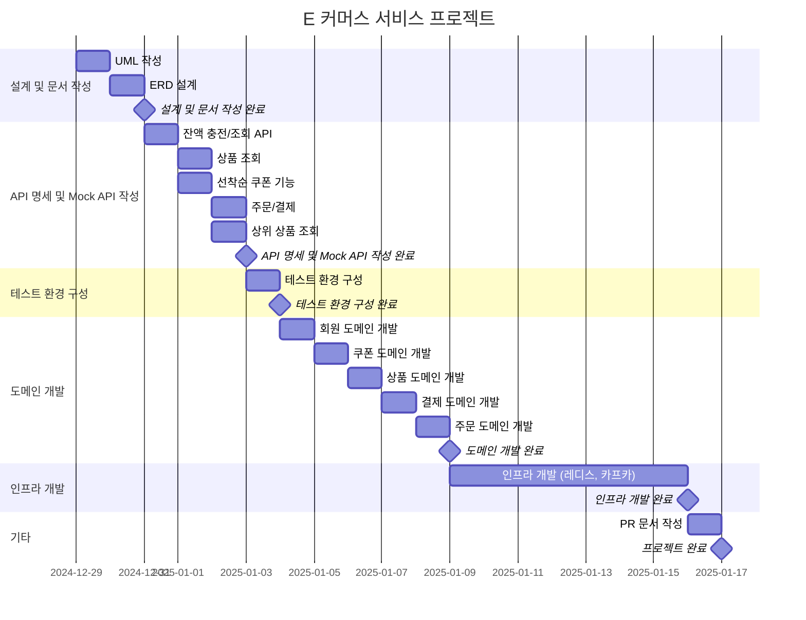

</details>

<details>
<summary>시퀀스 다이어그램</summary>

# 요구사항 기반 전체 시퀀스 다이어그램

아래 시퀀스 다이어그램은 **E 커머스 서비스의 주요 요구사항**에 따른 **도메인 간 상호작용**을 시각화한 것입니다.

**회원(사용자), 지갑, 쿠폰, 상품, 결제, 주문** 등 주요 도메인이 REST API 기반으로 어떻게 연동되는지 한눈에 파악할 수 있습니다.

### 주요 기능

- **사용자 잔액 충전 및 조회**
- **상품 정보 조회**
- **선착순 쿠폰 발급 및 조회**
- **주문 및 결제 처리**
- **데이터 플랫폼으로의 주문 정보 전송**

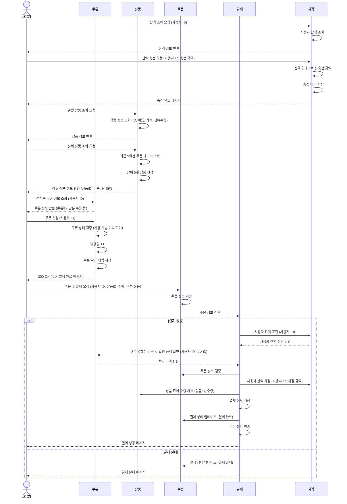

</details>

<details>
<summary>테이블 설계</summary>

# ERD

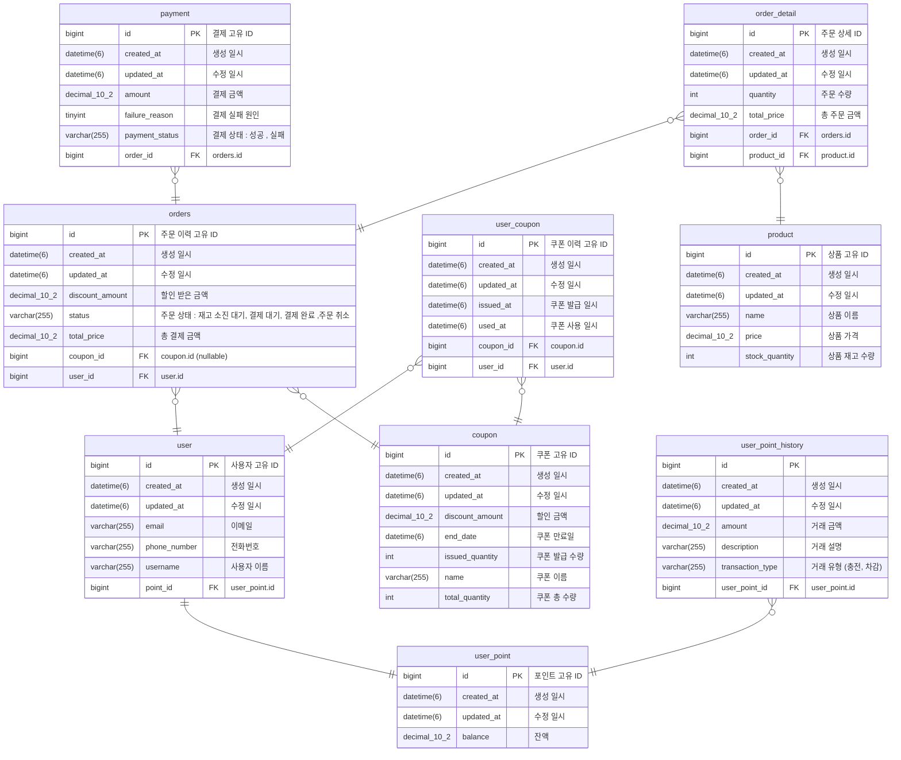

## 테이블/관계 설명

1. **`user` / `user_point`**
    - 사용자(`user`) 테이블은 포인트(`user_point`) 테이블을 참조(`point_id`)하여 1:1 관계를 형성합니다.
    - 한 명의 사용자는 하나의 포인트 계정(잔액 관리)을 갖습니다.
2. **`user_point_history`**
    - `user_point_history`는 **거래 내역**을 저장하는 테이블입니다.
    - `user_point_id`로 `user_point`를 참조하며, 사용자 포인트에 대한 충전·차감 기록을 저장합니다(다대일).
3. **`user_coupon`**
    - 쿠폰 발급 이력과 사용 이력을 관리하는 테이블입니다.
    - `coupon_id`로 `coupon`을, `user_id`로 `user`를 참조하며, 여러 사용자가 여러 쿠폰을 각각 발급·사용할 수 있습니다.
4. **`orders`**
    - 주문 이력을 저장하는 테이블로, 한 사용자(`user_id`)가 여러 주문을 가질 수 있습니다(다대일).
    - 옵션으로 `coupon_id`를 참조하며, 쿠폰을 사용하지 않은 경우 `NULL`이 가능합니다.
5. **`payment`**
    - 결제 정보를 저장하는 테이블로, 결제 상태(`payment_status`)와 실패 원인(`failure_reason`)을 함께 관리합니다.
    - 각 결제(`payment`)는 주문(`orders.id`)을 참조해 결제 대상을 명시합니다.
6. **`order_detail`**
    - 주문 상세 정보 테이블로, 주문(`order_id`)과 상품(`product_id`)을 참조합니다.
    - 한 주문에 여러 상품을 담을 수 있으므로, 주문-주문상세는 1:N 관계입니다.
7. **`coupon`**
    - 쿠폰의 메타정보(쿠폰 이름, 총 수량, 발급 수량, 할인 금액 등)을 저장합니다.
    - 유효기간(`end_date`)이 지나면 사용 불가능한 것으로 간주됩니다.
8. **`product`**
    - 상품 정보를 담고 있으며, `stock_quantity` 필드를 통해 재고 수량을 관리합니다.

</details>

<details>
<summary>API Swagger</summary>


</details>

<details>
<summary>동시성 제어</summary>

# E-Commerce 프로젝트의 주요 동시성 제어 방식 분석

현재 진행 중인 E-Commerce 프로젝트에서 여러 동시성 문제를 효과적으로 해결하기 위해 다양한 동시성 제어 방식을 도입하고, 이를 성능을 기준으로 분석할 계획입니다.

# 1. 주요 동시성 이슈

---

### 1. **선착순 쿠폰 발급**

- 발급 개수가 제한된 쿠폰의 동시 발급 요청

### 2. **결제 처리**

- 동시에 같은 상품 주문에 대한 결제를 진행할 때 상품 재고 차감

### 3. **포인트 충전 / 차감**

- 특정 유저의 포인트 충전과 차감이 동시에 진행될 경우

# 2. 동시성 제어 방식

---

분석해 볼 주요 동시성 제어 방식은 3가지로 아래와 같습니다.

1. 비관적 락(Pessimistic Lock)
2. 낙관적 락(Optimistic Lock)
3. Redis와 Redisson 라이브러리를 활용한 Pub/Sub 기반 락

# 3. 테스트 환경

---

- 테스트는 local 환경에서 진행할 예정이며 `@Profile("local")`에서만 부하 테스트를 진행할 데이터(유저, 포인트, 상품, 쿠폰, 주문 등)들을 미리 세팅해
  두었습니다.

테스트 데이터 초기화

```java
@Component
@Profile("local")
@RequiredArgsConstructor
public class LocalDataInitializer {

    private final LocalDummyData localDummyData;

    @PostConstruct
    public void init() {
        localDummyData.init();
    }
}
```

# 4. 테스트 도구 및 방법론

---

**테스트 도구**

- `K6`를 활용하여 동시성 테스트를 수행하고, `p90 ~ p99.9` 지표를 기준으로 성능을 분석.
- K6는 부하 테스트를 수행할 수 있는 오픈소스 도구로, 고성능 분산 테스트가 가능하며, Grafana와의 통합을 통해 시각화할 수 있음.

  [Grafana k6 | Grafana k6 documentation](https://grafana.com/docs/k6/latest/)

- 분석 지표
    - 응답 시간(Response Time)
    - 초당 처리량(RPS, Requests Per Second)
    - 실패율(Error Rate)
    - 성공률(Success Rate)

# 5. 테스트 시나리오 및 분석

---

동시성 제어 방식의 성능을 분석할 테스트 시나리오는 다음과 같습니다.

### **1) 선착순 쿠폰 발급 테스트**

- 시나리오
    - 비관적 락 / 낙관적 락(재시도x) / 낙관적 락(재시도o) / redisson
    - 100명의 사용자가 하나의 쿠폰에 대해 발급 요청을 동시에 전송.
    - 100개의 재고에 대해 모든 요청이 성공해야함.

쿠폰 발급

```java
@Service
@RequiredArgsConstructor
public class CouponService {

    private final CouponRepository couponRepository;

    @Transactional
    public void issueACoupon(Long couponId, Long userId) {
        Coupon coupon = couponRepository.getCouponWithLock(couponId);
        coupon.issuedCoupon(userId);
    }
}
```

### **비관적 락 (Pessimistic Lock) 테스트 결과 분석**

```bash
data_received..................: 7.3 kB 1.2 kB/s
data_sent......................: 16 kB  2.6 kB/s
http_req_blocked...............: avg=7.26ms  min=5ms      med=7ms    max=8.99ms p(50)=7ms    p(90)=8.99ms   p(95)=8.99ms   p(99)=8.99ms p(99.9)=8.99ms
http_req_connecting............: avg=3.26ms  min=1ms      med=2.99ms max=5.99ms p(50)=2.99ms p(90)=4.99ms   p(95)=5.99ms   p(99)=5.99ms p(99.9)=5.99ms
http_req_duration..............: avg=2.76s   min=396.54ms med=3.02s  max=5.17s  p(50)=3.02s  p(90)=4.64s    p(95)=4.94s    p(99)=5.1s   p(99.9)=5.16s
{ expected_response:true }...: avg=2.76s   min=396.54ms med=3.02s  max=5.17s  p(50)=3.02s  p(90)=4.64s    p(95)=4.94s    p(99)=5.1s   p(99.9)=5.16s
http_req_failed................: 0.00%  0 out of 100
http_req_receiving.............: avg=98.32µs min=0s       med=0s     max=1.68ms p(50)=0s     p(90)=517.54µs p(95)=534.03µs p(99)=1ms    p(99.9)=1.61ms
http_req_sending...............: avg=60.09µs min=0s       med=0s     max=1ms    p(50)=0s     p(90)=0s       p(95)=996.84µs p(99)=1ms    p(99.9)=1ms
http_req_tls_handshaking.......: avg=0s      min=0s       med=0s     max=0s     p(50)=0s     p(90)=0s       p(95)=0s       p(99)=0s     p(99.9)=0s
http_req_waiting...............: avg=2.76s   min=396.35ms med=3.02s  max=5.17s  p(50)=3.02s  p(90)=4.64s    p(95)=4.94s    p(99)=5.1s   p(99.9)=5.16s
http_reqs......................: 100    16.182417/s
iteration_duration.............: avg=3.77s   min=1.4s     med=4.03s  max=6.17s  p(50)=4.03s  p(90)=5.65s    p(95)=5.95s    p(99)=6.11s  p(99.9)=6.17s
iterations.....................: 100    16.182417/s
vus............................: 5      min=5        max=100
vus_max........................: 100    min=100      max=100
```

- **응답 시간 (Response Time)**
    - 평균 `2.76초`, 최대 `5.17초`로 요청 처리에 지연 발생.
    - P(50)=3.02s → 50%의 요청은 3초 내 처리되었으나, 상위 10%(P90=4.64s)부터 응답 시간이 증가하며, 상위 1%(P99=5.1s)는 처리 시간이 더
      길어짐.
- **초당 처리량 (RPS, Requests Per Second)**
    - 평균 `16.18 RPS`
- **실패율 (Error Rate)**
    - 실패율 `0%`
- **성공률 (Success Rate)**
    - 성공률 `100%`

### **낙관적 락 (Optimistic Lock) + 재시도 X 테스트 결과 분석**

```bash
data_received..................: 24 kB  10 kB/s
data_sent......................: 16 kB  7.0 kB/s
http_req_blocked...............: avg=3.8ms    min=2ms      med=4ms      max=5ms   p(50)=4ms      p(90)=5ms   p(95)=5ms    p(99)=5ms    p(99.9)=5ms
http_req_connecting............: avg=1.97ms   min=1ms      med=2ms      max=3ms   p(50)=2ms      p(90)=3ms   p(95)=3ms    p(99)=3ms    p(99.9)=3ms
http_req_duration..............: avg=823.1ms  min=425.94ms med=773.26ms max=1.26s p(50)=773.26ms p(90)=1.19s p(95)=1.26s  p(99)=1.26s  p(99.9)=1.26s
 { expected_response:true }...: avg=791.3ms  min=425.94ms med=766.83ms max=1.22s p(50)=766.83ms p(90)=1.12s p(95)=1.17s  p(99)=1.21s  p(99.9)=1.22s
http_req_failed................: 87.00% 87 out of 100
http_req_receiving.............: avg=335.34µs min=0s       med=0s       max=3.7ms p(50)=0s       p(90)=992µs p(95)=1.12ms p(99)=1.84ms p(99.9)=3.51ms
http_req_sending...............: avg=250.19µs min=0s       med=0s       max=1ms   p(50)=0s       p(90)=1ms   p(95)=1ms    p(99)=1ms    p(99.9)=1ms
http_req_tls_handshaking.......: avg=0s       min=0s       med=0s       max=0s    p(50)=0s       p(90)=0s    p(95)=0s     p(99)=0s     p(99.9)=0s
http_req_waiting...............: avg=822.51ms min=424.94ms med=772.76ms max=1.26s p(50)=772.76ms p(90)=1.19s p(95)=1.26s  p(99)=1.26s  p(99.9)=1.26s
http_reqs......................: 100    44.033454/s
iteration_duration.............: avg=1.82s    min=1.43s    med=1.77s    max=2.27s p(50)=1.77s    p(90)=2.2s  p(95)=2.26s  p(99)=2.27s  p(99.9)=2.27s
iterations.....................: 100    44.033454/s
vus............................: 27     min=27        max=100
vus_max........................: 100    min=100       max=100

```

- **응답 시간 (Response Time)**
    - 평균 `823.1ms`, 최대 `1.26초`로 빠른 응답 속도.
- **초당 처리량 (RPS, Requests Per Second)**
    - 평균 `44.03 RPS`로, 비관적 락 대비 처리량이 **약 2.7배 증가.**
    - 그러나 처리량 증가는 높은 충돌 발생으로 이어져 실질적 효과 제한.
- **실패율 (Error Rate)**
    - 실패율 `87%` (100건 중 87건 실패)로, 동시 요청 시 충돌 빈도가 매우 높음.
    - 트랜잭션 경합이 심각하며, 재시도 로직 도입이 필수적.
- **성공률 (Success Rate)**
    - 성공률 `13%`
    - 재시도 전략 없이는 안정적인 처리가 어려움.

### **낙관적 락 (Optimistic Lock) + 재시도(1초 간격, 최대 3회) 테스트 결과 분석**

```bash
data_received..................: 21 kB  4.2 kB/s
data_sent......................: 16 kB  3.2 kB/s
http_req_blocked...............: avg=5.29ms   min=4ms     med=5ms   max=7ms    p(50)=5ms   p(90)=6ms      p(95)=6ms    p(99)=7ms    p(99.9)=7ms
http_req_connecting............: avg=2.15ms   min=999.1µs med=2ms   max=4ms    p(50)=2ms   p(90)=3ms      p(95)=3ms    p(99)=4ms    p(99.9)=4ms
http_req_duration..............: avg=2.83s    min=508.2ms med=2.97s max=3.96s  p(50)=2.97s p(90)=3.85s    p(95)=3.91s  p(99)=3.94s  p(99.9)=3.96s
 { expected_response:true }...: avg=1.88s    min=508.2ms med=1.61s max=3.96s  p(50)=1.61s p(90)=3.56s    p(95)=3.81s  p(99)=3.93s  p(99.9)=3.96s
http_req_failed................: 72.00% 72 out of 100
http_req_receiving.............: avg=343.8µs  min=0s      med=0s    max=3.38ms p(50)=0s    p(90)=997.88µs p(95)=1.19ms p(99)=3.01ms p(99.9)=3.34ms
http_req_sending...............: avg=309.68µs min=0s      med=0s    max=999µs  p(50)=0s    p(90)=999µs    p(95)=999µs  p(99)=999µs  p(99.9)=999µs
http_req_tls_handshaking.......: avg=0s       min=0s      med=0s    max=0s     p(50)=0s    p(90)=0s       p(95)=0s     p(99)=0s     p(99.9)=0s
http_req_waiting...............: avg=2.83s    min=508.2ms med=2.96s max=3.96s  p(50)=2.96s p(90)=3.85s    p(95)=3.91s  p(99)=3.94s  p(99.9)=3.96s
http_reqs......................: 100    20.117727/s
iteration_duration.............: avg=3.84s    min=1.51s   med=3.97s max=4.96s  p(50)=3.97s p(90)=4.86s    p(95)=4.92s  p(99)=4.94s  p(99.9)=4.96s
iterations.....................: 100    20.117727/s
vus............................: 50     min=50        max=100
vus_max........................: 100    min=100       max=100

```

- **응답 시간 (Response Time)**
    - 평균 `3.45초`, 최대 `4.49초`로 재시도 적용 후 처리 시간이 증가.
    - P(50)=3.63s → 50%의 요청이 3.63초 내 처리되었으며, 상위 10%(P90=4.39s), 상위 1%(P99=4.49s)에서 응답 시간이 증가.
- **초당 처리량 (RPS, Requests Per Second)**
    - 평균 `18.20 RPS`로 재시도 적용 후 처리량이 다소 감소.
- **실패율 (Error Rate)**
    - 실패율 `70%` (100건 중 70건 실패)로, 재시도 적용에도 충돌이 지속적으로 발생.
- **성공률 (Success Rate)**
    - 성공률 `30%`로, 일부 요청만 성공적으로 처리됨.

### **Redisson 기반 Redis Pub/Sub 락 테스트 결과 분석**

```bash
data_received..................: 7.3 kB 1.1 kB/s
data_sent......................: 16 kB  2.5 kB/s
http_req_blocked...............: avg=3ms      min=1ms      med=3ms   max=4.51ms p(50)=3ms   p(90)=4.26ms   p(95)=4.26ms   p(99)=4.26ms p(99.9)=4.48ms
http_req_connecting............: avg=425.95µs min=0s       med=0s    max=2.99ms p(50)=0s    p(90)=999.5µs  p(95)=1ms      p(99)=2ms    p(99.9)=2.89ms
http_req_duration..............: avg=4.44s    min=762.16ms med=5.26s max=5.4s   p(50)=5.26s p(90)=5.3s     p(95)=5.34s    p(99)=5.36s  p(99.9)=5.4s
{ expected_response:true }...: avg=4.44s    min=762.16ms med=5.26s max=5.4s   p(50)=5.26s p(90)=5.3s     p(95)=5.34s    p(99)=5.36s  p(99.9)=5.4s
http_req_failed................: 0.00%  0 out of 100
http_req_receiving.............: avg=174.74µs min=0s       med=0s    max=1.39ms p(50)=0s    p(90)=636.46µs p(95)=890.72µs p(99)=1.39ms p(99.9)=1.39ms
http_req_sending...............: avg=119.89µs min=0s       med=0s    max=1.99ms p(50)=0s    p(90)=998.5µs  p(95)=998.5µs  p(99)=1.01ms p(99.9)=1.89ms
http_req_tls_handshaking.......: avg=0s       min=0s       med=0s    max=0s     p(50)=0s    p(90)=0s       p(95)=0s       p(99)=0s     p(99.9)=0s
http_req_waiting...............: avg=4.44s    min=761.64ms med=5.26s max=5.4s   p(50)=5.26s p(90)=5.3s     p(95)=5.34s    p(99)=5.36s  p(99.9)=5.4s
http_reqs......................: 100    15.597744/s
iteration_duration.............: avg=5.44s    min=1.76s    med=6.26s max=6.4s   p(50)=6.26s p(90)=6.3s     p(95)=6.34s    p(99)=6.36s  p(99.9)=6.4s
iterations.....................: 100    15.597744/s
vus............................: 66     min=66       max=100
vus_max........................: 100    min=100      max=100

```

- **응답 시간 (Response Time)**
    - 평균 `4.44초`, 최대 `5.4초`로, 락 획득 및 처리에 시간이 소요됨.
    - P(50)=5.26s → 50%의 요청이 5.26초 내 처리되었으며, 상위 10%(P90=5.3s), 상위 1%(P99=5.36s)에서도 비슷한 처리 시간이 소요됨.
    - 전체적으로 일정한 응답 시간이 유지되고 있으며, 락 경합으로 인한 추가적인 지연은 크지 않음.
- **초당 처리량 (RPS, Requests Per Second)**
    - 평균 `15.59 RPS`로 비관적 락이나 낙관적 락 대비 준수한 처리량을 보임.
- **실패율 (Error Rate)**
    - 실패율 `0%`
- **성공률 (Success Rate)**
    - 성공률 `100%`

---

### **2) 결제 처리 테스트**

- 시나리오
    - 비관적 락 / 낙관적 락
    - 100명의 사용자가 동시에 동일한 상품 3개에 대해 각 10개씩 주문한 상태에서 결제 요청을 전송
    - 상품 A, B, C의 재고는 각각 1000개로 설정
    - 각각의 사용자는 모두 결제에 성공해야 하며, 재고 차감도 정확히 이루어져야 함

결제

```java
@Component
@RequiredArgsConstructor
public class PaymentFacade {

    private final PaymentService paymentService;
    private final ProductService productService;
    private final PointService pointService;
    private final OrderService orderService;
    private final DataPlatform dataPlatform;

    @Transactional
    public void processOrderPayment(Long userId, Long orderId) {
        Order order = orderService.getCompleteOrder(orderId);
        productService.quantitySubtract(order.getProductQuantityMap());
        Payment payment = paymentService.pay(orderId, order.getTotalAmount());
        pointService.usePoints(userId, payment.getTotalAmount());
        dataPlatform.publish(orderId, payment.getId());
    }
}
```

동시성 제어 로직

- 상품 재고 차감 - productService.quantitySubtract(order.getProductQuantityMap());
- 유저 포인트 차감 - pointService.usePoints(userId, payment.getTotalAmount());

### **비관적 락 (Pessimistic Lock) 테스트 결과 분석**

```bash
data_received..................: 7.3 kB 1.0 kB/s
data_sent......................: 17 kB  2.4 kB/s
http_req_blocked...............: avg=4.23ms   min=1.61ms   med=3.9ms  max=6.39ms  p(50)=3.9ms  p(90)=5.62ms   p(95)=5.74ms   p(99)=6.24ms   p(99.9)=6.37ms
http_req_connecting............: avg=2.13ms   min=0s       med=2.19ms max=3.27ms  p(50)=2.19ms p(90)=2.76ms   p(95)=3.12ms   p(99)=3.27ms   p(99.9)=3.27ms
http_req_duration..............: avg=3.37s    min=588.81ms med=3.36s  max=6.16s   p(50)=3.36s  p(90)=5.6s     p(95)=5.9s     p(99)=6.11s    p(99.9)=6.16s
 { expected_response:true }...: avg=3.37s    min=588.81ms med=3.36s  max=6.16s   p(50)=3.36s  p(90)=5.6s     p(95)=5.9s     p(99)=6.11s    p(99.9)=6.16s
http_req_failed................: 0.00%  0 out of 100
http_req_receiving.............: avg=79.03µs  min=0s       med=0s     max=589µs   p(50)=0s     p(90)=514.36µs p(95)=527.45µs p(99)=533.26µs p(99.9)=583.42µs
http_req_sending...............: avg=192.49µs min=0s       med=0s     max=765.2µs p(50)=0s     p(90)=517.9µs  p(95)=620.42µs p(99)=654.32µs p(99.9)=754.11µs
http_req_tls_handshaking.......: avg=0s       min=0s       med=0s     max=0s      p(50)=0s     p(90)=0s       p(95)=0s       p(99)=0s       p(99.9)=0s
http_req_waiting...............: avg=3.37s    min=588.14ms med=3.36s  max=6.16s   p(50)=3.36s  p(90)=5.6s     p(95)=5.89s    p(99)=6.11s    p(99.9)=6.15s
http_reqs......................: 100    13.943314/s
iteration_duration.............: avg=4.38s    min=1.59s    med=4.37s  max=7.16s   p(50)=4.37s  p(90)=6.6s     p(95)=6.9s     p(99)=7.12s    p(99.9)=7.16s
iterations.....................: 100    13.943314/s
vus............................: 4      min=4        max=100
vus_max........................: 100    min=100      max=100

```

- **응답 시간 (Response Time)**
    - 평균 응답 시간은 `3.37초`로, 최대 응답 시간은 `6.16초` 로 요청 처리에 지연 발생.
    - P(50)=3.36s → 50%의 요청은 3.36초 이내에 처리되었으나, 상위 10%(P90=5.6s)부터 응답 시간이 증가하며, 상위 1%(P99=6.11s)는 처리
      시간이 더 길어짐
- **초당 처리량 (RPS, Requests Per Second)**
    - 평균 `13.94 RPS`
- **실패율 (Error Rate)**
    - 실패율`0%`
- **성공률 (Success Rate)**
    - 성공률 `100%`지만, 처리 지연시간이 누적됨.

### **낙관적 락 (Optimistic Lock) + 재시도(1초 간격, 최대 3회) 테스트 결과 분석**

```bash
data_received..................: 20 kB  3.8 kB/s
data_sent......................: 17 kB  3.3 kB/s
http_req_blocked...............: avg=5.55ms   min=3.64ms   med=5.71ms   max=7.58ms p(50)=5.71ms   p(90)=6.57ms p(95)=6.57ms p(99)=6.75ms p(99.9)=7.49ms
http_req_connecting............: avg=2.72ms   min=1.63ms   med=2.63ms   max=5.16ms p(50)=2.63ms   p(90)=3.64ms p(95)=4.17ms p(99)=5.16ms p(99.9)=5.16ms
http_req_duration..............: avg=3.4s     min=745.11ms med=3.56s    max=4.29s  p(50)=3.56s    p(90)=4.23s  p(95)=4.23s  p(99)=4.29s  p(99.9)=4.29s
{ expected_response:true }...: avg=2.58s    min=745.11ms med=2.64s    max=4.25s  p(50)=2.64s    p(90)=3.91s  p(95)=4.12s  p(99)=4.23s  p(99.9)=4.25s
http_req_failed................: 69.00% 69 out of 100
http_req_receiving.............: avg=309.06µs min=0s       med=0s       max=2.66ms p(50)=0s       p(90)=1.01ms p(95)=1.16ms p(99)=1.55ms p(99.9)=2.55ms
http_req_sending...............: avg=433.39µs min=0s       med=230.45µs max=1.51ms p(50)=230.45µs p(90)=1ms    p(95)=1.47ms p(99)=1.51ms p(99.9)=1.51ms
http_req_tls_handshaking.......: avg=0s       min=0s       med=0s       max=0s     p(50)=0s       p(90)=0s     p(95)=0s     p(99)=0s     p(99.9)=0s
http_req_waiting...............: avg=3.4s     min=742.45ms med=3.56s    max=4.29s  p(50)=3.56s    p(90)=4.23s  p(95)=4.23s  p(99)=4.29s  p(99.9)=4.29s
http_reqs......................: 100    18.849934/s
iteration_duration.............: avg=4.41s    min=1.75s    med=4.57s    max=5.3s   p(50)=4.57s    p(90)=5.24s  p(95)=5.24s  p(99)=5.3s   p(99.9)=5.3s
iterations.....................: 100    18.849934/s
vus............................: 24     min=24        max=100
vus_max........................: 100    min=100       max=100

```

- **응답 시간 (Response Time)**
    - 평균 응답 시간은 `3.4초`로, 최대 응답 시간은 `4.29초`로 요청 처리에 지연 발생.
    - P(50)=3.56s → 50%의 요청은 3.56초 이내에 처리, 상위 10%(P90=4.23s)부터 상위 1%(P99=4.29s)는 비슷하게 유지됨.
- **초당 처리량 (RPS, Requests Per Second)**
    - 평균 `18.85 RPS`.
- **실패율 (Error Rate)**
    - 실패율`69%`
- **성공률 (Success Rate)**
    - 성공률`31%`

---

### **3) 포인트 충전/차감 테스트**

- 시나리오
    - 비관적 락 / 낙관적 락(재시도o) / redisson
    - 특정 사용자 `userId`를 대상으로, 100번의 동시 요청을 번갈아 충전/차감 전송.
    - 모든 충전 및 차감이 정합성 있게 적용되어야 함.

포인트 충전 차감

```java
@Service
@RequiredArgsConstructor
public class PointService {

  private final PointRepository pointRepository;

  @Transactional
  public void chargePoint(Long userId, BigDecimal amount) {
    pointRepository.getPointByUserIdWithLock(userId)
        .charge(amount);
  }

  @Transactional
  public void usePoints(Long userId, BigDecimal totalAmount) {
    pointRepository.getPointByUserIdWithLock(userId)
        .subtract(totalAmount);
  }
}
```

### **비관적 락 (Pessimistic Lock) 테스트 결과 분석**

```bash
data_received..................: 15 kB 985 B/s
data_sent......................: 36 kB 2.4 kB/s
http_req_blocked...............: avg=829.11µs min=0s       med=0s     max=5.09ms   p(50)=0s     p(90)=2.67ms   p(95)=3.44ms   p(99)=4.82ms   p(99.9)=5.07ms
http_req_connecting............: avg=213.43µs min=0s       med=0s     max=2.18ms   p(50)=0s     p(90)=591.3µs  p(95)=1ms      p(99)=1.35ms   p(99.9)=2.01ms
http_req_duration..............: avg=5.32s    min=489.14ms med=6.38s  max=7.39s    p(50)=6.38s  p(90)=7.21s    p(95)=7.32s    p(99)=7.34s    p(99.9)=7.38s
{ expected_response:true }...: avg=5.32s    min=489.14ms med=6.38s  max=7.39s    p(50)=6.38s  p(90)=7.21s    p(95)=7.32s    p(99)=7.34s    p(99.9)=7.38s
http_req_failed................: 0.00% 0 out of 200
http_req_receiving.............: avg=94.19µs  min=0s       med=0s     max=694.5µs  p(50)=0s     p(90)=515.54µs p(95)=526.97µs p(99)=559.25µs p(99.9)=670.69µs
http_req_sending...............: avg=47.75µs  min=0s       med=0s     max=909.59µs p(50)=0s     p(90)=4.12µs   p(95)=505.49µs p(99)=909.59µs p(99.9)=909.59µs
http_req_tls_handshaking.......: avg=0s       min=0s       med=0s     max=0s       p(50)=0s     p(90)=0s       p(95)=0s       p(99)=0s       p(99.9)=0s
http_req_waiting...............: avg=5.32s    min=488.67ms med=6.38s  max=7.39s    p(50)=6.38s  p(90)=7.21s    p(95)=7.32s    p(99)=7.34s    p(99.9)=7.38s
http_reqs......................: 200   13.499094/s
iteration_duration.............: avg=11.65s   min=8.45s    med=11.59s max=14.8s    p(50)=11.59s p(90)=14.12s   p(95)=14.39s   p(99)=14.7s    p(99.9)=14.79s
iterations.....................: 100   6.749547/s
vus............................: 13    min=13       max=100
vus_max........................: 100   min=100      max=100

```

- **응답 시간 (Response Time)**
    - 평균 응답 시간은 `5.32초`, 최대 응답 시간은 `7.39초`로 전반적으로 높은 응답 지연이 발생.
    - 50%의 요청(P50)은 `6.38초` 이내에 처리되었으며, 상위 10%(P90)는 `7.21초`로 큰 차이는 없음.
- **초당 처리량 (RPS, Requests Per Second)**
    - 평균 `13.49 RPS`
- **실패율 (Error Rate)**
    - 실패율 `0%`
- **성공률 (Success Rate)**
    - 성공률 `100%`

### **낙관적 락 (Optimistic Lock) + 재시도(1초 간격, 최대 3회) 테스트 결과 분석**

```bash
data_received..................: 42 kB  5.5 kB/s
data_sent......................: 36 kB  4.7 kB/s
http_req_blocked...............: avg=4.3ms    min=0s       med=4ms     max=11ms   p(50)=4ms     p(90)=9ms      p(95)=9.99ms p(99)=10.01ms p(99.9)=11ms
http_req_connecting............: avg=1.07ms   min=0s       med=997.9µs max=6ms    p(50)=997.9µs p(90)=2.63ms   p(95)=3.64ms p(99)=6ms     p(99.9)=6ms
http_req_duration..............: avg=2.74s    min=125.44ms med=2.85s   max=3.98s  p(50)=2.85s   p(90)=3.73s    p(95)=3.86s  p(99)=3.92s   p(99.9)=3.97s
{ expected_response:true }...: avg=1.81s    min=125.44ms med=1.8s    max=3.93s  p(50)=1.8s    p(90)=3.14s    p(95)=3.69s  p(99)=3.89s   p(99.9)=3.93s
http_req_failed................: 72.00% 144 out of 200
http_req_receiving.............: avg=292.26µs min=0s       med=0s      max=5.62ms p(50)=0s      p(90)=739.52µs p(95)=1.04ms p(99)=3.49ms  p(99.9)=5.22ms
http_req_sending...............: avg=374.29µs min=0s       med=0s      max=2ms    p(50)=0s      p(90)=1ms      p(95)=2ms    p(99)=2ms     p(99.9)=2ms
http_req_tls_handshaking.......: avg=0s       min=0s       med=0s      max=0s     p(50)=0s      p(90)=0s       p(95)=0s     p(99)=0s      p(99.9)=0s
http_req_waiting...............: avg=2.74s    min=125.44ms med=2.85s   max=3.98s  p(50)=2.85s   p(90)=3.73s    p(95)=3.86s  p(99)=3.92s   p(99.9)=3.97s
http_reqs......................: 200    26.121487/s
iteration_duration.............: avg=6.5s     min=2s       med=6.62s   max=7.65s  p(50)=6.62s   p(90)=7.55s    p(95)=7.55s  p(99)=7.65s   p(99.9)=7.65s
iterations.....................: 100    13.060743/s
vus............................: 43     min=43         max=100
vus_max........................: 100    min=100        max=100

```

- **응답 시간 (Response Time)**
    - 평균 응답 시간은 `2.74초`, 최대 `3.98초`
    - 50%의 요청(P50)은 `2.85초` 이내에 처리되었으며, 상위 10%(P90)는 `3.73초`, 상위 1%(P99)는 `3.92초`
- **초당 처리량 (RPS, Requests Per Second)**
    - 평균 `26.12 RPS`
- **실패율 (Error Rate)**
    - 전체 요청의 `72%`가 실패(144건/200건)하여 심각한 장애 발생.
    - 응답이 늦어지거나 재시도 로직 적용에도 불구하고 요청이 정상적으로 처리되지 않는 문제 발생.
- **성공률 (Success Rate)**
    - 성공률 `28%`

### **Redisson 기반 Redis Pub/Sub 락 테스트 결과 분석**

```bash
data_received..................: 15 kB 803 B/s
data_sent......................: 36 kB 2.0 kB/s
http_req_blocked...............: avg=3.62ms   min=0s       med=1.28ms max=13.16ms p(50)=1.28ms p(90)=10ms     p(95)=11ms     p(99)=11.01ms  p(99.9)=12.96ms
http_req_connecting............: avg=445.86µs min=0s       med=0s     max=3ms     p(50)=0s     p(90)=1.24ms   p(95)=2ms      p(99)=2ms      p(99.9)=2.8ms
http_req_duration..............: avg=6.57s    min=709.34ms med=8.01s  max=9.07s   p(50)=8.01s  p(90)=8.63s    p(95)=8.66s    p(99)=8.85s    p(99.9)=9.06s
{ expected_response:true }...: avg=6.57s    min=709.34ms med=8.01s  max=9.07s   p(50)=8.01s  p(90)=8.63s    p(95)=8.66s    p(99)=8.85s    p(99.9)=9.06s
http_req_failed................: 0.00% 0 out of 200
http_req_receiving.............: avg=57.06µs  min=0s       med=0s     max=565µs   p(50)=0s     p(90)=505.41µs p(95)=522.34µs p(99)=537.31µs p(99.9)=561.75µs
http_req_sending...............: avg=424.18µs min=0s       med=0s     max=9.16ms  p(50)=0s     p(90)=1ms      p(95)=1ms      p(99)=6.01ms   p(99.9)=8.73ms
http_req_tls_handshaking.......: avg=0s       min=0s       med=0s     max=0s      p(50)=0s     p(90)=0s       p(95)=0s       p(99)=0s       p(99.9)=0s
http_req_waiting...............: avg=6.57s    min=709.32ms med=8.01s  max=9.07s   p(50)=8.01s  p(90)=8.63s    p(95)=8.66s    p(99)=8.85s    p(99.9)=9.06s
http_reqs......................: 200   10.996321/s
iteration_duration.............: avg=14.15s   min=10.25s   med=14.1s  max=18.18s  p(50)=14.1s  p(90)=17.38s   p(95)=17.74s   p(99)=18.02s   p(99.9)=18.16s
iterations.....................: 100   5.49816/s
vus............................: 2     min=2        max=100
vus_max........................: 100   min=100      max=100

```

- **응답 시간 (Response Time)**
    - 평균 **`6.57`초**, 최대 `**9.07`초**로 응답 지연이 크며, 50%의 요청이 **8.01초** 이상으로 처리됨.
- **초당 처리량 (RPS, Requests Per Second)**
    - 평균 **`10.99 RPS`**, 락 경쟁으로 처리 속도가 제한됨.
- **실패율 (Error Rate)**
    - 실패율 **`0%`**
- **성공률 (Success Rate)**
    - 성공률 **`100%`**

# 결론

---

**선착순 쿠폰 발급**의 경우, **Redisson 분산 락**이 가장 적절한 선택이라고 판단되었습니다.

그 이유는 테스트 결과, 비관적 락이 다소 더 나은 응답 속도를 보였지만, 락을 대기하는 동안 데이터베이스(DB) 커넥션을 지속적으로 유지해야 합니다.

트래픽이 증가할수록 DB의 커넥션 수가 병목 현상을 유발할 수 있으며, DB의 확장은 매우 어렵고 비용이 높습니다.

반면, **Redis는 DB에 부하를 주지 않고, 수평적 확장이 용이**하기 때문에 높은 동시성을 요구하는 환경에서 적합하다 판단했습니다.

**상품 재고 차감**의 경우, 현재 결제 파사드(Facade) 구조에서는 분산 락 적용이 어렵다고 분석되었습니다.

파사드 자체에 락을 적용하는 것은 불가능하며, **재고 차감 및 포인트 차감** 두 영역에 각각 락을 적용해야 합니다.

하지만, 분산 락을 적용하려면 트랜잭션 시작 전에 락을 획득해야 하며, 이로 인해 **새로운 트랜잭션 생성 비용이 추가**됩니다.

또한, **재고 차감이 성공했지만 포인트 차감이 실패할 경우**, 이미 커밋된 재고를 복구해야 하는 추가 작업이 필요합니다.

이러한 점을 종합적으로 고려했을 때, 현재 구조에 가장 적합한 해결책은 **비관적 락을 적용하는 것**으로 결정하였습니다.

**포인트 충전**의 경우, 사용자가 동일한 요청을 여러 번 호출하는 상황에서는 충돌 발생 시 재시도 로직이 필요하지 않아 **낙관적 락**을 고려했습니다.

그러나 테스트 결과, 특정 시나리오(예: 충전 및 차감이 동시에 이루어지는 경우)에서는 **모든 요청이 정확하게 처리되어야 하는 비즈니스 요구사항**이 존재했습니다.

따라서, 선착순 쿠폰 발급과 마찬가지로 **Redisson 분산 락을 적용**하여 높은 정합성을 유지하도록 결정했습니다.

---

### **각 동시성 제어 방식의 장단점 분석**

테스트 결과를 통해 각 락의 장단점을 파악한 결과는 다음과 같습니다.

1. **비관적 락 (Pessimistic Lock)**
    - **장점:** 높은 정합성 보장, 모든 요청이 순차적으로 성공하도록 보장.
    - **단점:** 트래픽 증가 시 대기 시간이 증가하고, 응답 속도가 저하됨.
    - **적용 사례:** 반드시 성공해야 하는 비즈니스 로직, 재시도를 하기엔 비용이 많이 드는 작업(예: 결제 시 재고 차감).
2. **낙관적 락 (Optimistic Lock)**
    - **장점:** 애플리케이션 단에서 처리되어 빠른 응답 속도 제공.
    - **단점:** 동시성 충돌이 빈번할 경우, 성공할 때까지 재시도로 인해 성능이 저하될 수 있음.
    - **적용 사례:** 실패해도 재시도 로직이 필요없으며 빠른 응답이 더 중요한 작업(예: 좌석 예약).
3. **Redisson 분산 락 (Distributed Lock)**
    - **장점:** 비관적 락 수준의 정합성을 제공하며, DB 부하 없이 수평적 확장 가능.
    - **단점:** Redis 장애 발생 시 복구 전략이 복잡하며, 운영 및 학습 비용이 높음.
    - **적용 사례:** 확장성과 정합성이 동시에 요구되는 작업(예: 선착순 쿠폰, 포인트 충전/차감).

이러한 분석을 기반으로, **상품 재고 관리에는 비관적 락을 적용하고, 쿠폰 발급 및 포인트 충전과 같은 기능에는 Redisson 분산 락을 적용**하기로 결정했습니다.

</details>

<details>
<summary>Redis 캐시 전략 정리 및 성능 개선</summary>

# e커머스 서비스에서 Redis 캐싱을 활용한 성능 개선 분석 및 적용 방안

# 캐시란?

---

- 데이터의 원본보다 더 빠르고 효율적으로 액세스할 수 있는 임시 데이터 저장소를 의미합니다.

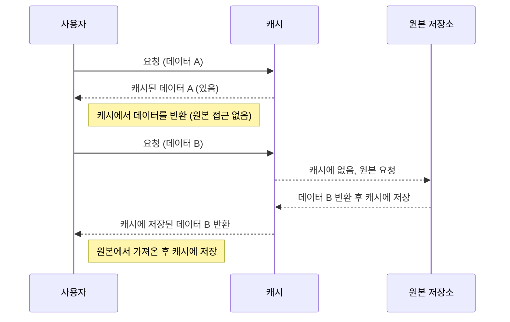

- 위와 같은 과정을 거쳐 사용자가 동일한 정보를 반복적으로 액세스할때 원본이 아니라 캐시에서 데이터를 가지고 옴으로써 리소스를 줄일 수 있습니다.

# **캐시를 사용하면 좋은 경우**

---

1. 원본 데이터 저장소에서 데이터를 찾는 데 시간이 오래 걸리거나, 매번 계산이 필요한 경우
2. 데이터가 자주 조회되지만 변화가 적은 경우

애플리케이션에서 캐시의 궁극적인 목적은 사용자의 대기 시간을 단축하는 것입니다. 따라서 위 조건을 만족하더라도, 캐시에서 데이터를 가져오는 속도가 원본 데이터 저장소에서 직접
가져오는 것보다 빨라야 합니다.

# 레디스를 캐시로 사용할 때 주요 캐싱 전략 4가지

---

캐싱 전략은 캐싱되는 데이터의 유형과 데이터에 대한 액세스 패턴에 따라 다르기 때문에 서비스에 맞는 적절한 캐싱 전략을 선택하는 것이 중요합니다.

## 1. 읽기 전략(look aside)

---

데이터를 읽어갈 때 주로 사용하는 전략입니다.

애플리케이션이 레디스를 캐시로 사용할 때 데이터를 조회하는 과정에는 캐시 히트와 캐시 미스라는 용어가 나오는데, 그 과정은 아래와 같습니다.

### **캐시 히트 (Cache Hit)**

애플리케이션이 요청한 데이터가 캐시에 존재하는 경우 캐시에서 데이터를 읽어옵니다.

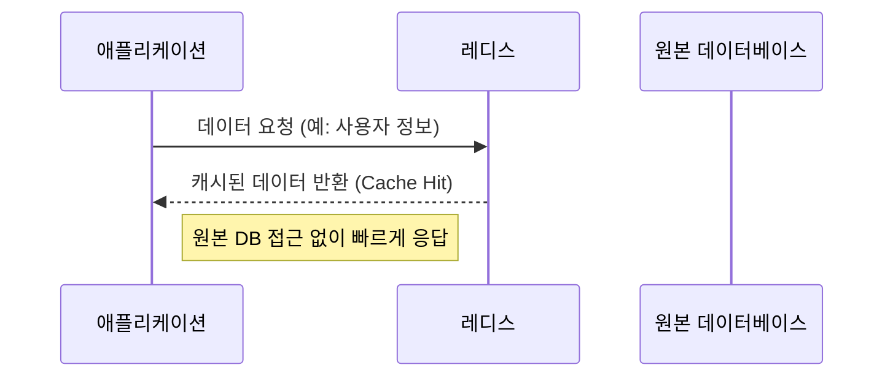

### **캐시 미스 (Cache Miss)**

애플리케이션이 요청한 데이터가 캐시에 없어서 원본 데이터베이스에서 가져옵니다. 이후 애플리케이션은 이를 다시 캐시에 저장합니다.

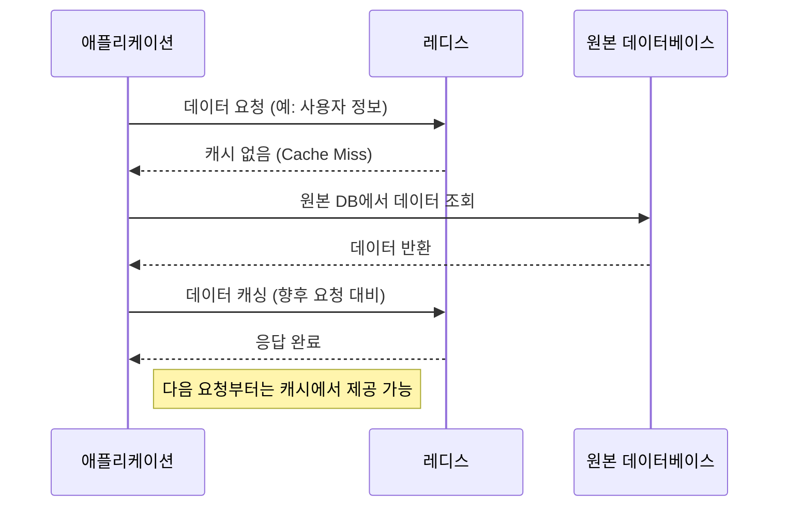

장점

- 레디스에 문제가 생겨 접근을 할 수 없는 상황이더라도 바로 서비스 장애로 이어지지 않고 데이터베이스에서 데이터를 가져올 수 있습니다.

단점

- 기존에 애플리케이션에서 레디스를 통해 데이터를 가져오는 연결이 많았으면, 모든 커넥션이 한꺼번에 원본 데이터베이스로 몰리기 때문에 애플리케이션의 성능에 영향을 미칠 수
  있습니다.
- lazy loading 구조로 저장되기 때문에 애플리케이션은 데이터를 찾기 위해 레디스에 매번 먼저 접근해 캐시 미스 과정을 거쳐서 성능에 영향을 미칠 수 있습니다. (이를
  방지 하기 위한 캐시 워밍 작업이 있는데, 캐시 워밍이란 데이터베이스에 저장된 데이터를 레디스로 밀어넣는 것을 말함)
- 캐시는 데이터베이스에 저장돼 있는 데이터를 단순히 복사해 온 값이기 때문에 원본 데이터와 동일한 값을 갖도록 유지하지 않으면 캐시 불일치(데이터 간 불일치)가 발생합니다.

## 2. 쓰기 전략(write through)

---

write through 방식은 데이터베이스에 업데이트 할 때마다 매번 캐시에도 데이터를 함께 업데이트 시키는 방식입니다.

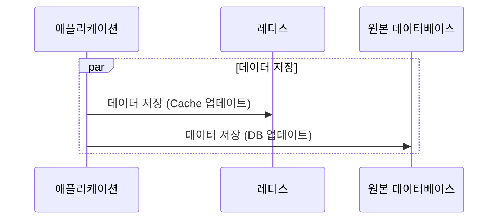

장점

- 캐시는 항상 최신 데이터를 가지고 있을 수 있습니다.

단점

- 데이터는 매번 2개의 저장소에 저장돼야 하기 때문에 쓰기 비용이 많이 발생합니다.

## 3. 쓰기 전략(cache invalidation)

---

cache invalidation은 데이터베이스에 값을 업데이트 할 때마다 캐시에서는 데이터를 삭제하는 전략입니다.

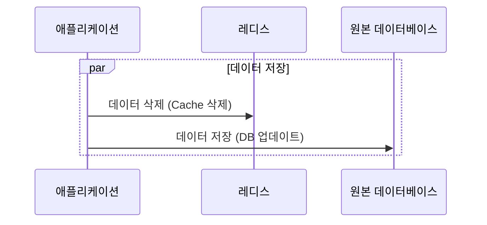

장점

- 레디스의 데이터 삭제는 데이터를 저장하는 것보다 훨씬 리소스를 적게 사용하기 때문에 write through의 단점인 캐시 불일치 해소를 위한 쓰기 비용을 줄일 수 있습니다.

단점

- 조회 시 캐시 미스 과정이 발생합니다.

## 4. 쓰기 전략(write behind[write back])

쓰기가 많이 발생하는 서비스라면 아래와 같이 write behind 방식을 적용해볼 수 있습니다.

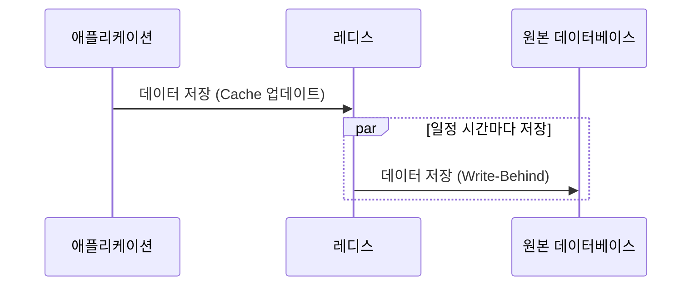

위와 같이 먼저 데이터를 빠르게 접근할 수 있는 캐시에 업데이트 한 뒤 설정한 건수나 시간 간격에 따라 비동기적으로 데이터베이스에 저장하는 방식입니다.

장점

- 대용량 트래픽이 발생할 경우 실시간으로 원본 데이터베이스에 저장하지 않기 때문에 데이터베이스의 성능을 향상시켜 애플리케이션 전체의 성능도 향상시킬 수 있습니다.

단점

- 캐시에 문제가 생겨 데이터가 날라갈 경우 설정한 건수나 시간만큼의 데이터가 날라갈 수 있다는 위험이 있습니다.

# 캐시 스탬피드 현상

---

캐시 스탬피드는 동시 다발적인 캐시 미스로 인해 DB 부하가 급증하는 현상이며, 이를 방지하려면 TTL 최적화 및 사전 갱신 전략이 필요합니다.

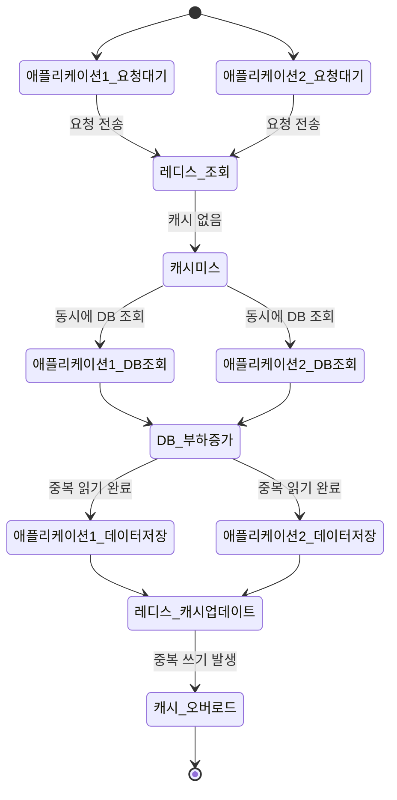

Redis를 캐시로 사용할 때 모든 키에 만료 시간을 설정하는 것이 일반적이지만, 특정 키가 만료되는 순간 다수의 클라이언트가 동시에 요청하면 캐시 미스가 발생하여 다음과 같은
문제가 생길 수 있습니다.

1. 캐시 미스로 인한 중복 읽기로 DB에 대량의 요청이 발생합니다.
2. 캐시 업데이트 과정에서 중복 읽기 만큼의 중복 쓰기가 발생합니다.
3. 캐시는 무거운 쿼리에 많이 활용되는데 무거운 쿼리가 동시에 실행되어 시스템 부하가 가중됩니다.

해결 방법

- 캐시 스탬피드를 방지하려면 만료 시간을 너무 짧게 설정하지 않고, 동시에 데이터가 만료되기 전에 미리 갱신(cache warming)하여 여러 요청이 한꺼번에 DB로 몰리는
  상황을 방지하는 작업이 필요할 수 있습니다.

# E 커머스 서비스에서 Redis를 이용해 성능 개선할 수 있는 로직 분석

---

## 1. 상위 주문 상품 5개 조회

```java
public List<ProductResponse.Top5ProductDetails> getProductsTop5() {
    return queryFactory
            .select(new QProductResponse_Top5ProductDetails(
                    product.id,
                    product.name,
                    product.price,
                    product.stockQuantity,
                    orderDetail.quantity.sum()
            ))
            .from(orderDetail)
            .innerJoin(orderDetail.order, order)
            .innerJoin(product)
            .on(
                    product.id.eq(orderDetail.productId)
            )
            .where(
                    order.status.eq(Order.OrderStatus.ORDER_COMPLETE)
            )
            .groupBy(
                    product.id,
                    product.name,
                    product.price,
                    product.stockQuantity
            )
            .orderBy(orderDetail.quantity.sum().desc())
            .limit(5)
            .fetch();
}
```

### 문제점

1. 집계 연산 부하
    - `SUM(quantity)`를 통해 정렬하는 과정에서 전체 주문 데이터를 스캔해야 함
    - 데이터 양이 많아질수록 DB 부하 증가
2. 동시 요청 시 성능 저하
    - 많은 사용자가 상위 주문 상품 목록을 조회할 경우, 동일한 무거운 쿼리가 반복 실행됨
    - CPU 사용량 증가 및 DB 커넥션 과부하 발생 가능
3. 응답 속도 지연
    - 실시간으로 DB에서 주문량 상위 5개 상품을 조회할 경우 쿼리 실행 시간이 길어져 사용자 경험 저하

### 레디스 캐싱 선택 이유 및 예상 결과

DB 부하 감소

- 모든 요청이 DB로 가는 것이 아니라 캐시에서 처리
- 상위 주문 상품 목록 조회 트래픽이 증가해도 원본 DB 부하가 증가하지 않음

응답 속도 개선

- 요청 시 매번 무거운 쿼리를 실행 하지 않기 때문에 응답 속도 개선 효과

Redis의 빠른 읽기 성능 활용

- Redis는 메모리 기반으로 동작하여 읽기 속도가 매우 빠름

### 성능 개선을 위한 해결 방안 (Redis 캐싱 적용)

- Look-Aside 전략으로 Spring Cache 인터페이스를 활용한 캐싱
- 상위 주문 상품 목록은 생각보다 자주 변경되지 않으며, 실시간 데이터보다 빠른 응답이 중요
    - 자주 변경된다면 TTL을 더 짧게 적용하여 어느정도 해소 가능
- 캐시 워밍(Cache Warming) 으로 캐시 스탬피드 문제 방지

### 코드 구현

> RedisConfig.java
>

```java
@Bean
public CacheManager redisCacheManager() {
  RedisCacheManager.RedisCacheManagerBuilder builder = RedisCacheManager
      .RedisCacheManagerBuilder
      .fromConnectionFactory(redisConnectionFactory());

  ObjectMapper objectMapper = new ObjectMapper();
  objectMapper.registerModule(new JavaTimeModule()); // LocalDateTime 지원
  objectMapper.activateDefaultTyping(
      objectMapper.getPolymorphicTypeValidator(),
      ObjectMapper.DefaultTyping.NON_FINAL
  );

  RedisCacheConfiguration configuration = RedisCacheConfiguration
      .defaultCacheConfig()
      .serializeKeysWith(
          RedisSerializationContext.SerializationPair.fromSerializer(new StringRedisSerializer()))
      .serializeValuesWith(RedisSerializationContext.SerializationPair.fromSerializer(
          new GenericJackson2JsonRedisSerializer(objectMapper)))
      .entryTtl(Duration.ofMinutes(90));
  builder.cacheDefaults(configuration);
  return builder.build();
}
```

- **`objectMapper.activateDefaultTyping(...)`** 설정으로 `GenericJackson2JsonRedisSerializer` 를 사용한 리스트
  자료 구조의 직렬화/역직렬화 문제를 방지
- **`.entryTtl(Duration.ofMinutes(90))`** 설정으로 캐시 TTL을 90분으로 지정

> ProductService.java
>

```java
@Cacheable(value = "top5ProductDetails", key = "'top5'", cacheManager = "redisCacheManager")
@Transactional(readOnly = true)
public List<ProductResponse.Top5ProductDetails> getProductsTop5() {
  return productRepository.getProductsTop5();
}
```

- 서비스에서 @Cacheable을 활용해 지정한 redisCacheManager로 요청 결과를 캐싱

> RedisCacheRefresher.java
>

```java
@Component
@RequiredArgsConstructor
public class RedisCacheRefresher {

  private final ProductQuerydslRepository productQuerydslRepository;
  private final CacheManager redisCacheManager;

  @Scheduled(fixedRate = 3600000)
  public void refreshTop5ProductsCache() {
    List<ProductResponse.Top5ProductDetails> updatedProducts = productQuerydslRepository.getProductsTop5();
    redisCacheManager.getCache("top5ProductDetails").put("top5", updatedProducts);
  }
}
```

- 1시간마다 TTL(1시간 30분)이 만료되기 전, repository를 통해 DB에서 데이터를 직접 읽어와 새로 갱신

> k6를 사용한 100번의 동시 요청 부하 테스트
>

테스트 조건

- 100명의 동시 사용자가 요청
- 캐시 적용 전 vs 캐시 적용 후
- 요청당 응답 대기 시간(http_req_waiting) 비교

> 캐시 적용 전
>

```java
http_req_waiting...............: avg=1.31s    min=377.91ms med=1.35s  max=2.27s  p(50)=1.35s  p(90)=2.14s    p(95)=2.21s   p(99)=2.27s   p(99.9)=2.27s
http_reqs......................: 100   43.669144/s
```

> 캐시 적용 후
>

```java
http_req_waiting...............: avg=330.07ms min=323.99ms med=330.1ms  max=335.62ms p(50)=330.1ms  p(90)=333.28ms p(95)=333.77ms p(99)=335.11ms p(99.9)=335.57ms
http_reqs......................: 100   287.66821/s
```

- 캐시 적용 후 평균 응답 속도가 **약 4배(3.97배, 1310ms → 330.07ms) 향상**되었으며, 일반적인 요청(`p50`)에서는 **4.09배(1350ms →
  330.1ms)**, 높은 부하(`p90`)에서는 **6.42배(2140ms → 333.28ms)**, 최악의 경우(`p99`)에도 **6.77배(2270ms →
  335.11ms)** 개선되어 전반적인 성능이 크게 향상됨.

### 결론

개선 전

- 집계 연산으로 인해 DB 부하 발생
- 동시 요청 시 성능 저하 및 응답 지연

개선 후

- 상위 주문 상품 목록 데이터를 Redis에 1시간마다 캐싱하여 DB 부하를 줄이고 빠르게 응답

---

## 2. 선착순 쿠폰 발급 레디스 로직 이관 구상

> CouponService.java
>

```java
  @DistributedLock(key = "'COUPON_' + #couponId")
  @Transactional
  public void issueACoupon(Long couponId, Long userId) {
    Coupon coupon = couponRepository.getCoupon(couponId);
    coupon.issuedCoupon(userId);
  }
  
  // Coupon.java issuedCoupon
  public void issuedCoupon(Long userId) {
    checkExpiry();
    if (userId == null) {
        throw new IllegalArgumentException("유효하지 않은 사용자.");
    }
    if (this.issuedQuantity == this.totalQuantity) {
        throw new IllegalArgumentException("발급 수량 소진");
    }
    if (this.issuedCoupons.stream().anyMatch(issuedCoupon -> issuedCoupon.getUserId().equals(userId))) {
        throw new IllegalArgumentException("같은 쿠폰은 하나만 발급 가능합니다.");
    }
    this.issuedQuantity++;

    IssuedCoupon issuedCoupon = createIssuedCoupon(this, userId);
    this.issuedCoupons.add(issuedCoupon);
}
```

### 문제점

1. 분산락으로 인한 성능 저하
    - 기존 방식은 `@DistributedLock`을 사용하여 동시성 제어를 진행했으나, 고트래픽(수십만 건 이상) 환경에서 성능 병목이 발생할 가능성이 높음
    - 분산락이 설정되어 있어, 쿠폰 발급 시 동시 요청이 많아질 경우 시스템 처리 속도가 저하될 수 있음
2. 중복 발급 방지 미흡
    - 기존 로직에서는 `issuedCoupons` 리스트를 순회하며 사용자별 중복 발급을 방지하나, 데이터베이스에 직접 접근하는 방식으로 인해 성능 저하 가능성이 존재함

### 레디스 캐싱 선택 이유 및 예상 결과

레디스 활용 기대 효과

- 고성능 처리
    - Redis의 `Sorted Set(ZSET)`을 활용하여 선착순 발급을 보장하고, `Set(SADD)`을 이용해 중복 발급을 방지함으로써 레디스의 부하를 줄일 수 있음.
- 비동기 처리
    - 쿠폰 발급 요청을 바로 데이터베이스에서 처리하는 것이 아니라, Redis에서 먼저 처리한 후 일정 주기로 배치 작업을 통해 데이터베이스에 반영.

### 성능 개선을 위한 해결 방안 (Redis 캐싱 적용)

**1. 쿠폰 선착순 요청 처리 (Sorted Set 활용)**

- `Sorted Set(ZSET)` 자료구조를 이용하여 쿠폰 발급 요청을 저장하고, 요청 순서에 따라 발급자를 선정.
- `score` 값을 요청 시각(timestamp)으로 설정하여 요청 순서 보장.

### **의사 코드**

```
ZADD coupon-135135-requests <timestamp> "user1"
ZADD coupon-135135-requests <timestamp> "user2"
ZADD coupon-135135-requests <timestamp> "user3"

ZPOPMIN coupon-135135-requests 2 // 상위 2명 발급
// user1, user3
```

- `ZADD` - 쿠폰 발급 요청자를 추가 (사용자 식별자, 요청 시간)
- `ZPOPMIN` - 특정 개수만큼 발급할 사용자 조회 및 제거

**2. 쿠폰 중복 발급 방지 (Set 활용)**

- `Set(SADD)` 자료구조를 활용하여 이미 발급된 사용자를 저장.
- `SISMEMBER`를 이용해 특정 사용자가 이미 쿠폰을 발급받았는지 확인.

### **의사 코드**

```
SADD coupon-135135-issued "user1"
SADD coupon-135135-issued "user2"

SCARD coupon-135135-issued // 현재 발급 개수 조회
SISMEMBER coupon-135135-issued "user1" // 이미 발급받은 사용자 확인
```

- `SADD` - 신규 발급 사용자 추가
- `SCARD` - 현재 발급된 쿠폰 개수 조회
- `SISMEMBER` - 특정 사용자의 발급 여부 확인

**3. 쿠폰 발급 방식 (비동기 처리)**

- 요청이 오면 **Redis에서 선착순 요청을 등록**하고, 별도의 **스케줄러가 주기적으로 요청을 처리하여 DB에 반영**하는 구조.
- 이렇게 하면 쿠폰 발급 요청이 몰려도 DB 부하 없이 처리가 가능하며, 순차적인 발급이 보장됨.

### **스케줄러 로직 (의사 코드)**

1. DB에서 쿠폰의 남은 수량 조회.
2. Redis `ZPOPMIN`을 통해 해당 개수만큼 요청자를 가져옴.
3. Redis `SADD`를 사용해 쿠폰 발급 완료 처리.
4. DB에 실제로 쿠폰 발급 내역을 반영.
5. **남은 요청자들에게 발급 실패 메시지 전송.**

```java
int availableCoupons = getAvailableCouponsFromDB(); // DB에서 발급 가능 수량 조회
List<String> selectedUsers = redis.zpopmin("coupon-135135-requests", availableCoupons); // 선착순 n명 선택
List<String> failedUsers = redis.zrange("coupon-135135-requests", 0, -1); // 남은 요청자 조회

for (String user : selectedUsers) {
    if (!redis.sismember("coupon-135135-issued", user)) { // 중복 발급 여부 체크
        redis.sadd("coupon-135135-issued", user); // 발급 완료 처리
        issueCouponInDB(user); // DB에 반영
    }
}

// 발급 실패한 사용자들에게 메시지 전송
for (String failedUser : failedUsers) {
    sendFailureMessage(failedUser);
}
```

### 기대 효과

- **데이터베이스 부하 감소**
    - 실시간 트랜잭션을 줄이고, 비동기 처리로 부하를 최소화함.
- **고속 처리 가능**
    - Redis를 활용하여 수십만 건 이상의 트래픽도 원활히 처리 가능.
- **선착순 보장**
    - `Sorted Set`을 통해 요청 순서를 보장하며, 스케줄러를 활용해 정해진 수량만큼만 발급.
- **중복 발급 방지**
    - `Set`을 사용하여 사용자가 중복으로 발급받는 것을 방지.
- **발급 실패 사용자 대응**
    - 선착순에서 밀려난 사용자들에게 적절한 피드백 제공.

이러한 방식으로 Redis 기반으로 선착순 쿠폰 발급을 개선하면, 높은 트래픽 환경에서도 효율적인 처리가 가능할 것으로 예상됨.

# Reference

- [개발자를 위한 레디스 - 김가림](https://product.kyobobook.co.kr/detail/S000210785682)

</details>

<details>
<summary>상위 상품 조회 인덱스 적용 성능 개선 분석</summary>

# 인덱스 적용 성능 개선 분석

<br><br>

### 개요

E커머스 프로젝트의 꽃은 비즈니스 상품의 조회 성능이라고 생각합니다. 이 글은 E 커머스 프로젝트를 개발하며 상위 상품 조회를 인덱스를 추가하기 전과 추가한 후 쿼리의 성능 개선
정도를 파악하며 학습하기 위한 글입니다.
<br><br>

### 인덱스란? 인덱스를 적용하는 이유는?

**추가적인 쓰기 작업과 저장 곤간을 활용하여 데이터베이스 테이블의 검색 속도를 향상시키기 위한 자료구조**

인덱스는 특정 열 값이 있는 행을 빠르게 찾는 데 사용됩니다. 인덱스가 없으면 데이터베이스는 첫 번째 행부터 시작하여 전체 테이블을 읽어 관련 행을 찾아야 합니다. 테이블에 해당
열에 대한 인덱스가 있는 경우 데이터베이스는 모든 데이터를 살펴보지 않고도 데이터 파일 중간에서 찾을 위치를 빠르게 결정할 수 있습니다. 이는 모든 행을 순차적으로 읽는 것보다
훨씬 빠릅니다.
<br><br>

### 일상 생활의 예시

우리가 책에서 원하는 내용을 찾고 싶으면 한장한장 넘겨보는게 아닌 책의 맨 앞 또는 맨 뒤에 색인을 찾아보는 것처럼, 데이터베이스에서도 데이터와 데이터의 위치를 포함한 자료구조를
생성하여 빠르게 조회할 수 있도록 돕고 있습니다.
<br><br>

### 그럼 모든 필드 인덱스 적용하면 좋은거 아니에요?

> 항해 백엔드 7기 QnA 내용 일부
>

결론부터 말하면 **그렇지 않습니다.** 여러 문서를 참고했을 때 대략 인덱스가 없는 기본적인 테이블의 쓰기 비용을 1이라고 잡았을 경우 해당 테이블의 인덱스에 키를 추가하는 작업
비용을 1.5 정도로 예측합니다. 즉 테이블에 인덱스가 3개가 있다면 작업 비용이 3 * 1.5 + 1 = 5.5 정도 됩니다. (약 5배) 즉, **쓰기 작업보다 조회 작업이
압도적으로 많은 상품 조회와 같은 쿼리에 사용되는 테이블에 추가하기 적합**합니다.

이제 상위 상품 조회에 인덱스 추가 전후 실행계획을 비교해보며 인덱스를 적용해 보겠습니다.
<br><br>

### 상위 상품 조회

주문이 완료된 상품들의 주문 수량의 합이 가장 큰 상품 5개를 가져오는 쿼리

> ProductQuerydslRepository.java
>

```java
public List<ProductResponse.Top5ProductDetails> getProductsTop5() {
  return queryFactory
      .select(new QProductResponse_Top5ProductDetails(
          product.id,
          product.name,
          product.price,
          product.stockQuantity,
          orderDetail.quantity.sum()
      ))
      .from(orderDetail)
      .innerJoin(orderDetail.order, order)
      .innerJoin(product)
      .on(
          product.id.eq(orderDetail.productId)
      )
      .where(
          order.status.eq(Order.OrderStatus.ORDER_COMPLETE),
          order.createdAt.between(LocalDateTime.now().minusDays(3), LocalDateTime.now())
      )
      .groupBy(
          product.id,
          product.name,
          product.price,
          product.stockQuantity
      )
      .orderBy(orderDetail.quantity.sum().desc())
      .limit(5)
      .fetch();
}
```

> 쿼리 결과
>

```java
select
        p1_0.id,
        p1_0.name,
        p1_0.price,
        p1_0.stock_quantity,
        sum(od1_0.quantity) 
    from
        order_detail od1_0 
    join
        orders o1_0 
            on o1_0.id=od1_0.order_id 
    join
        product p1_0 
            on p1_0.id=od1_0.product_id 
    where
        o1_0.status='ORDER_COMPLETE'
        and o1_0.created_at between '2025-02-11' and '2025-02-14'
    group by
        p1_0.id,
        p1_0.name,
        p1_0.price,
        p1_0.stock_quantity 
    order by
        sum(od1_0.quantity) desc 
    limit
        5
```

```sql
id   |name         |price  |stock_quantity|sum(od1_0.quantity)|
-----+-------------+-------+--------------+-------------------+
 2712|product 2711 |1000.00|          1000|               1804|
19509|product 19508|1000.00|          1000|               1000|
34743|product 34742|1000.00|          1000|                999|
40511|product 40510|1000.00|          1000|                998|
 8206|product 8205 |1000.00|          1000|                998|
```

이제 위의 쿼리에 대해 실행 계획을 확인해 보겠습니다.
<br><br>

### 실행 계획이란?

MySQL 서버로 요청된 쿼리는 결과는 동일하지만 내부적으로 그 결과를 만들어내는 방법은 매우 다양한데, 우리가 여행을 할 때도 인터넷이나 책 등을 참고해서 최소한의 비용이 드는
효율적인 여행 경로를 결정하듯이 MySQL에서도 쿼리를 최적으로 실행하기 위해 각 테이블의 데이터가 어떤 분포로 저장돼 있는지 통계 정보를 참조하며 실행 계획을 수립하는 작업이
필요합니다.

MySQL 에서는 EXPLAIN이라는 명령으로 쿼리의 실행 계획을 확인할 수 있습니다.

> 실행 계획 컬럼 설명
>

| 컬럼              | 설명                                       |
|-----------------|------------------------------------------|
| `id`            | 실행 순서를 나타냄. 숫자가 클수록 먼저 실행                |
| `select_type`   | 쿼리 유형 (SIMPLE, SUBQUERY, DERIVED 등)      |
| `table`         | 접근하는 테이블 이름                              |
| `partitions`    | 사용된 파티션 (일반적으로 비어 있음)                    |
| `type`          | 조회 방식 (ALL, INDEX, RANGE, REF, EQ_REF 등) |
| `possible_keys` | 사용할 수 있는 인덱스 목록                          |
| `key`           | 실제 사용된 인덱스                               |
| `key_len`       | 인덱스 길이                                   |
| `ref`           | 조인된 테이블의 어떤 컬럼이 사용되었는지                   |
| `rows`          | MySQL이 예상하는 처리할 행 개수                     |
| `filtered`      | 필터링 후 남는 행의 비율 (%)                       |
| `Extra`         | 추가적인 정보 (Using where, Using filesort 등)  |

> 실행 계획 확인
>

```sql
id|select_type|table|partitions|type  |possible_keys              |key                        |key_len|ref                    |rows|filtered|Extra                                       |
--+-----------+-----+----------+------+---------------------------+---------------------------+-------+-----------------------+----+--------+--------------------------------------------+
 1|SIMPLE     |o1_0 |          |ALL   |PRIMARY                    |                           |       |                       | 500|    5.56|Using where; Using temporary; Using filesort|
 1|SIMPLE     |od1_0|          |ref   |FKrws2q0si6oyd6il8gqe2aennc|FKrws2q0si6oyd6il8gqe2aennc|8      |market.o1_0.id         |   1|   100.0|                                            |
 1|SIMPLE     |p1_0 |          |eq_ref|PRIMARY                    |PRIMARY                    |8      |market.od1_0.product_id|   1|   100.0|                                            |
```

실행 계획에서 type 열은 테이블을 어떻게 조회하는지를 나타내며, 가장 중요한 성능 지표 중 하나입니다.

위의 쿼리를 보면 테이블 풀 스캔으로 전체 데이터를 탐색하는 것을 확인할 수 있습니다. 또한, filtered 를 보면 5.56%로 필터링 후 남는 비율을 나타내는데 이것으로
얼마나 비효율 적인지 파악할 수 있습니다.
<br><br>

### 상위 상품 조회 실행 계획 핵심 요약

1. order 테이블의 테이블 Full Scan
2. 비효율 적인 where절 필터링
   <br><br>

### 최적화 방법 (인덱스 추가)

```sql
ALTER TABLE orders ADD INDEX idx_status_created_at (status, created_at);
```

위와 같이 복합 인덱스를 적용한 근거는 주문의 상태는 카디널리티가 낮지만 먼저 필터링 조건에 사용되며 뒤에 있는 created_at이 카디널리티가 높으므로 위와 같은 순서로 복합
인덱스를 적용해야 효율적으로 정렬되어 있는 많은 데이터 중 상태를 먼저 거른 후 상태에 맞게 정렬되어 있는 날짜를 탐색할 거로 생각했기 때문입니다.

인덱스를 추가한 후 실행 계획이 어떻게 변했는지 확인해 보겠습니다.

> 실행 계획 확인
>

```sql
id|select_type|table|partitions|type  |possible_keys                |key                        |key_len|ref                    |rows|filtered|Extra                                                    |
--+-----------+-----+----------+------+-----------------------------+---------------------------+-------+-----------------------+----+--------+---------------------------------------------------------+
 1|SIMPLE     |o1_0 |          |range |PRIMARY,idx_status_created_at|idx_status_created_at      |9      |                       | 250|   100.0|Using where; Using index; Using temporary; Using filesort|
 1|SIMPLE     |od1_0|          |ref   |FKrws2q0si6oyd6il8gqe2aennc  |FKrws2q0si6oyd6il8gqe2aennc|8      |market.o1_0.id         |   5|   100.0|                                                         |
 1|SIMPLE     |p1_0 |          |eq_ref|PRIMARY                      |PRIMARY                    |8      |market.od1_0.product_id|   1|   100.0|                                                         |
```

type을 먼저 확인해보면 ALL → range로 범위 검색이 가능해 진 것을 확인할 수 있으며 row 수 또한 ORDER_COMPLETE 상태에 맞는 row 수로 필터링 된 것을
볼 수 있습니다. 또한 key에서 위에서 만든 복합 인덱스를 잘 활용하는 것도 확인할 수 있었습니다.
<br><br>

### 인덱스 적용 성능 개선 분석 결론

- 인덱스를 적용함으로써 데이터 조회 속도를 최적화하고, 불필요한 테이블 풀 스캔을 방지할 수 있었습니다.
- 읽기 성능이 중요한 쿼리(특히 조회 빈도가 높은 상품 조회)에서는 적절한 인덱스 설계가 필수적임을 확인하였습니다.
- 간단한 인덱스 적용만으로도 쿼리 성능을 크게 개선할 수 있다는 것을 학습할 수 있었습니다.
  <br><br>

### 참고 자료

- https://mangkyu.tistory.com/96
- https://dev.mysql.com/doc/refman/8.0/en/column-indexes.html
- [Real Mysql 8.0 1권](https://product.kyobobook.co.kr/detail/S000001766482)

</details>

<details>
<summary>MSA로 전환을 위한 결제 서비스 분리 및 트랜잭션 처리 방안 설계</summary>

# 개요

E-커머스 결제 서비스의 트랜잭션 범위가 너무 길게 설정되어 있으며, Payment 애플리케이션 로직에서 결제에 필요한 부가적인 작업(재고 차감, 포인트 차감 등)을 함께 처리하고
있어 서비스 확장성이 낮고 대량 트래픽에 적합하지 않습니다.

이에 따라 MSA 구조로 전환하는 방안을 설계하고, 이벤트 기반 처리 구조에서 발생하는 트랜잭션 문제와 해결 방안을 학습하기 위한 글입니다.
<br><br>

# 기존 결제 시스템 분석

> PaymentFacade.java
>

```java
@Component
@RequiredArgsConstructor
public class PaymentFacade {

  private final PaymentService paymentService;
  private final ProductService productService;
  private final PointService pointService;
  private final OrderService orderService;
  private final DataPlatform dataPlatform;

  @Transactional
  public void processOrderPayment(Long userId, Long orderId) {
    Order order = orderService.getCompleteOrder(orderId);
    productService.quantitySubtract(order.getProductQuantityMap());
    Payment payment = paymentService.pay(orderId, order.getTotalAmount());
    pointService.usePoints(userId, payment.getTotalAmount());
    dataPlatform.publish(orderId, payment.getId());
  }
}
```

<br><br>

### 메서드 요약

간단히 설명하면, 결제 API 요청 시 해당 파사드의 메서드를 호출하여 주문의 상태 정보를 조회하고, 재고를 차감한 뒤 결제를 진행하며, 포인트를 차감한 후, 주문 정보를 데이터
플랫폼에 저장하기 위한 외부 API를 호출하는 방식으로 동작합니다.

<br><br>

### 문제 상황

**데이터 수집 플랫폼 API의 응답 지연 문제**

- 주문 데이터를 데이터 수집 플랫폼으로 전달하는 API의 응답 지연이 발생하면, 결제 프로세스 전체가 지연되는 문제가 발생합니다.

**트랜잭션 범위가 과도하게 넓음**

- 현재 파사드에 `@Transactional`이 적용되어 있어 트랜잭션 범위가 지나치게 길게 설정되어 있습니다.
- 데이터 수집 플랫폼 API 호출이 포함되어 있어 외부 시스템의 지연이나 장애가 핵심 비즈니스 로직(결제)에도 영향을 미치는 구조입니다.
- 데이터 수집 플랫폼의 API 호출이 실패하면, 결제 및 주문 처리가 정상적으로 완료되었더라도 전체 트랜잭션이 롤백되는 문제가 있습니다.

**데이터 정합성 문제**

- 데이터 수집 플랫폼에는 정상적으로 주문 정보가 저장되었으나, 결제 과정에서 FLUSH 중 오류가 발생하면, 실제 결제가 이루어지지 않았음에도 데이터 수집 플랫폼에는 정상적인
  주문 데이터가 전달되는 불일치 문제가 발생할 가능성이 있습니다.

<br><br>

### 핵심 문제 정리

- 외부 API의 응답 지연이 결제 프로세스를 블로킹함
- 트랜잭션 범위가 과도하게 넓어 서비스 확장성과 장애 대응이 어렵다
- 데이터 정합성이 깨질 가능성이 있으며, 결제 실패 시 외부 시스템에 잘못된 데이터가 저장될 위험이 있음

<br><br>

# 서비스 분리 설계 및 트랜잭션 처리의 한계

위의 `processOrderPayment` 메서드에서 호출하는 각 서비스는 서로 다른 도메인에 속하기 때문에, 도메인별로 배포 단위를 분리해야 한다고 가정하면, 서비스별로
독립적인 트랜잭션을 유지할 수 있도록 설계할 필요가 있습니다.

즉, 주문 상태 관리, 재고 차감, 결제 처리, 포인트 차감, 데이터 수집 플랫폼 전송 등의 기능을 각각의 독립적인 서비스로 분리하고, 각 서비스의 트랜잭션을 개별적으로 관리하는
방식으로 설계해야 합니다.

> 트랜잭션 분리 설계
>

```java
주문_TX() {
	주문_조회();
}
상품_TX() {
	재고_차감();
}
결제_TX() {
	결제_정보_생성();
}
포인트_TX() {
	포인트_차감();
}
데이터_플랫폼_TX() {
	주문_결제_정보_전송();
}
```

이렇게 설계하면 데이터 플랫폼 전송이 다른 트랜잭션에 영향을 주지 않게 되며, 각 도메인이 개별적인 트랜잭션을 가지므로 트랜잭션 범위를 짧게 유지할 수 있습니다.

> 트랜잭션 처리의 한계
>

하지만 트랜잭션이 분리된 구조에서는 데이터 정합성을 보장하기 어려우며, 일부 서비스가 실패할 경우 전체 프로세스를 원자적으로 유지하는 것이 어려울 수 있습니다.

특히, 재고 차감 후 결제가 실패하는 경우, 이미 감소된 재고를 복구하는 처리가 필요하며, 각 단계가 성공적으로 완료되지 않으면 전체적으로 앞의 단계를 롤백할 수 있는 작업이
필요합니다. (재고 복구 등)

<br><br>

# 해결방안

### SAGA 패턴

SAGA 패턴이란 마이크로서비스들끼리 이벤트를 주고 받아 특정 마이크로서비스에서의 작업이 실패하면 이전까지의 작업이 완료된 마이크서비스들에게 보상 (complemetary)
이벤트를 소싱함으로써 분산 환경에서 원자성(atomicity)을 보장하는 패턴입니다.

아래는 SAGA 패턴의 동작 과정입니다.

<br><br>

### SAGA 패턴의 이벤트 성공 시 동작 과정


<br><br>

### SAGA 패턴의 이벤트 실패 시 동작 과정


<br><br>

### SAGA 패턴의 핵심 개념

SAGA 패턴에서는 트랜잭션 관리가 DBMS가 아닌 애플리케이션 레벨에서 이루어지며, 각 서비스는 개별적인 로컬 트랜잭션만 담당합니다.

즉, 분산된 환경에서 트랜잭션의 실패로 인한 롤백은 각 애플리케이션에서 직접 구현해야 하며, DBMS의 글로벌 트랜잭션이 아닌 애플리케이션 간 이벤트 기반으로 트랜잭션의 흐름을
제어합니다.

이러한 구조를 통해 트랜잭션이 순차적으로 처리되며, 최종 단계에서 모든 프로세스가 완료되었을 때 데이터가 영속적으로 저장됩니다.

이를 통해 분산 환경에서도 데이터 정합성을 유지하면서 일관성을 보장할 수 있습니다.

<br><br>

### 코레오그래피(Choreography) 기반 SAGA 패턴

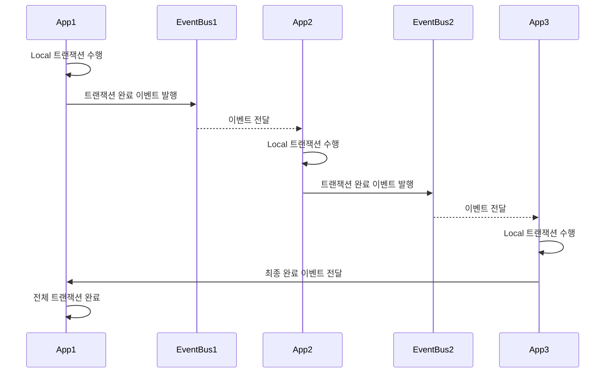

<br><br>

### **Choreography-based Saga 패턴 개요**

Choreography-based Saga 패턴에서는 각 서비스가 자체적으로 Local 트랜잭션을 관리하며, 트랜잭션이 완료되면 이벤트를 발행합니다.

이벤트를 수신한 다음 서비스는 해당 이벤트를 기반으로 트랜잭션을 수행하고, 완료 후 다시 이벤트를 발행하는 방식으로 프로세스를 이어갑니다.

이러한 이벤트 흐름은 Kafka와 같은 메시지 큐를 활용하여 비동기적으로 전달할 수 있으며, 중앙 오케스트레이션 없이도 서비스 간 트랜잭션을 순차적으로 처리할 수 있습니다.

<br><br>

### E 커머스 결제 로직에 **Choreography-based Saga 패턴** 적용 예시

1. OrderService(주문 서비스)가 주문을 조회하고, 주문 완료 이벤트를 발행
2. ProductService(상품 서비스)는 주문 완료 이벤트를 받아 재고 차감 후, 완료 이벤트를 발행
3. PaymentService(결제 서비스)는 재고 차감 완료 이벤트를 받아 결제 정보를 생성하고 완료 이벤트를 발행
4. PointService(포인트 서비스)는 결제 완료 이벤트를 받아 포인트 차감 후 완료 이벤트를 발행
5. DataPlatformService(데이터 플랫폼)는 포인트 차감 완료 이벤트를 받아 주문 데이터를 외부로 전송
6. 모든 트랜잭션이 완료되면 OrderService가 최종 완료를 확인하고 프로세스를 종료

<br><br>

### 장점

- 구현이 간단하고 편합니다.

<br><br>

### 단점

- 개발자 입장에서 트랜잭션의 현재 상태를 확인하기 어렵습니다.

<br><br>

# 결론

트랜잭션을 분리할 경우, 항상 실패 상황을 고려하고 이에 대한 적절한 트랜잭션 처리 방안을 마련하는 것이 중요합니다.

이번 학습에서는 기존 E-커머스의 결제 로직을 참고하여 MSA 아키텍처로 변환하는 과정을 가정하였으며, MSA 환경에서 가장 널리 사용되는 트랜잭션 관리 패턴인 Saga 패턴에
대해 학습할 수 있었습니다.

<br><br>

# 참고 자료

- https://azderica.github.io/01-architecture-msa/
- [https://github.com/rueun/hhplus-concert-reservation/blob/main/docs/MSA_TRANSACTION.md#서비스-분리-및-주요-담당-업무](https://github.com/rueun/hhplus-concert-reservation/blob/main/docs/MSA_TRANSACTION.md#%EC%84%9C%EB%B9%84%EC%8A%A4-%EB%B6%84%EB%A6%AC-%EB%B0%8F-%EC%A3%BC%EC%9A%94-%EB%8B%B4%EB%8B%B9-%EC%97%85%EB%AC%B4)

</details>

<details>

<summary>핵심 이커머스 API 부하 테스트 및 성능 분석</summary>

# 핵심 이커머스 API 부하 테스트 및 성능 분석

### 목차

- [개요](#개요)
- [테스트 환경 구성](#테스트-환경-구성)
- [테스트 API](#테스트-api)
- [테스트 스크립트 작성](#테스트-스크립트-작성)
- [테스트 스크립트 설명](#테스트-스크립트-설명)
- [결과 및 해석](#결과-및-해석)
- [부하 테스트 결론](#부하-테스트-결론)

### 개요

최근 개발 중인 이커머스 프로젝트가 거의 마무리되어 가며, 여러 가지 의문이 생겼습니다.

“내가 만든 프로젝트는 과연 몇 명의 사용자가 안정적으로 사용할 수 있을까?”
“서버 사양을 어느 정도로 구성해야 100개의 동시 트래픽을 견딜 수 있는 서비스를 제공할 수 있으며, 100개의 동시 트래픽을 견디는 서버 사양은 몇개의 동시 트래픽 시점부터
병목 현상이 심하게 발생할까?”

“선착순 쿠폰 발급 서비스에 사용된 레디스, 데이터 플랫폼 전송 로직에 사용된 카프카 등은 부하가 생겼을때 어떻게 동작할까?”

위와 같은 많은 의문중 이커머스의 핵심 비즈니스 API에 100개의 동시 트래픽이 왔을 경우 어느정도 부하가 걸리는지 파악하기 위해 부하 테스트와 서버 모니터링을 진행하여, 특정
트래픽 수준에서 요구되는 서버 사양과 한계를 정확히 파악하고자 이 글을 작성하게 되었습니다.

### 테스트 환경 구성

서버와 부하 테스트는 모두 로컬 환경의 하나의 컴퓨터 실행합니다. 로컬 환경이 실제 운영 환경과 동일한 결과얻지 못하겠지만, 이를 통해 로컬 환경에서 부하 테스트를 진행할 때
나타나는 한계점도 얻을 수 있을 것이라 생각합니다.

부하 테스트 도구로는 k6를 사용합니다. 부하 테스트 도구로 k6를 선택한 이유는 자바스크립트 문법을 기반으로 하여 서버 API 호출을 간단한 스크립트 작성만으로 수행할 수
있으며, 설치 및 설정이 nGrinder 등 다른 도구에 비해 비교적 간단하기 때문입니다.

모니터링은 프로메테우스와 그라파나 조합을 사용합니다. 이 조합은 여러 멘토링과 강의에서 편리하고 좋다는 말을 많이 들었으며, 실제로 현재 여러 기업에서 사용중인 검증된 모니터링
도구입니다. 또한, 설치 및 설정하는 것이 간단하고, 시각화에 필요한 대시보드 템플릿, 메신저 알림 연동등 편리한 기능을 많이 제공한다는 점에서 선택하게 되었습니다.

### 테스트 API

1. 선착순 쿠폰 발급
2. 주문서 생성
3. 결제

총 3개의 API를 활용하여 테스트를 진행합니다.

결제 이후 주문/결제 정보를 외부 데이터 플랫폼으로 전송하는 기능은 mock으로 대체합니다.

### 테스트 스크립트 작성

<details>


<summary>스크립트</summary>

```javascript
    import http from "data/k6/http";
import {sleep} from "k6";

export let options = {
  vus: 100,         // 100명의 가상 사용자
  iterations: 100,  // 각 VU가 한 번씩 실행
};

const BASE_URL = 'http://localhost:8080/api/v1';
const COUPON_ID = 1;

export default function () {
  const userId = __VU; // 각 VU마다 고유한 userId 할당

  // 1. 쿠폰 발급 요청
  let couponUrl = `${BASE_URL}/coupons/${COUPON_ID}?userId=${userId}`;
  let couponRes = http.post(couponUrl, null, {
    headers: {"Content-Type": "application/json"},
  });

  sleep(10);

  if (couponRes.status === 400) {
    let errorResponse = couponRes.json();
    console.warn(
        `User ${userId} failed to get a coupon: ${errorResponse.message}`);
    return; // 쿠폰 발급 실패 시 이후 요청 중단
  }

  // 2. 주문 생성 요청 (발급받은 쿠폰 사용)
  let orderUrl = `${BASE_URL}/orders`;
  let orderRequest = {
    userId: userId,
    products: [
      {productId: 1, quantity: 2},
      {productId: 2, quantity: 1},
      {productId: 3, quantity: 5},
    ],
  };

  let orderRes = http.post(orderUrl, JSON.stringify(orderRequest), {
    headers: {"Content-Type": "application/json"},
  });

  if (orderRes.status === 400) {
    let errorResponse = orderRes.json();
    console.warn(
        `User ${userId} failed to create an order: ${errorResponse.message}`);
    return; // 주문 생성 실패 시 이후 요청 중단
  }

  // 주문 응답에서 orderId 추출 (응답 형식에 따라 수정 필요)
  let orderData = orderRes.json();
  let orderId = orderData.orderId;  // orderId가 없으면 임시로 userId 사용

  // 3. 결제 요청
  let paymentUrl = `${BASE_URL}/payment`;
  let payRequest = {
    userId: userId,
    orderId: orderId,
  };

  let payRes = http.post(paymentUrl, JSON.stringify(payRequest), {
    headers: {"Content-Type": "application/json"},
  });

  // 결제 결과 로깅 (필요 시 응답 체크)
  if (payRes.status === 400) {
    let errorResponse = payRes.json();
    console.warn(
        `User ${userId} failed to process payment: ${errorResponse.message}`);
  }

  sleep(1);
}

```

</details>

### 테스트 스크립트 설명

사용자가 선착순 쿠폰을 발급한 이후 주문과 결제를 단계적으로 진행하는 상황을 가정하여 테스트 스크립트를 작성하였습니다.

선착순 쿠폰 발급 후 sleep(10); 을 걸어준 것은 선착순 쿠폰 발급은 레디스 sorted set 자료 구조를 활용한 스케줄링 방식으로 처리되고 있기 때문에 스케줄이
정상적으로 도는 시간을 기다리기 위해서 입니다.

또한 100명의 가상 사용자가 단 한 번씩 요청을 보내는 부하 테스트는 스트레스 테스트와는 엄연히 다른 테스트 방법입니다.

부하 테스트의 목적은 주로 시스템 성능을 확인하는 것에 중점을 두고, 스트레스 테스트는 극한의 조건으로 시스템의 동작 중지가 됐을 경우 장애 복구 및 허점을 찾아내기 위한 것에
중점을 뒀다는 차이점이 있습니다. 즉 부하 테스트는 특정 부하가 모두 끝나면 테스트가 끝난 것이지만 스트레스 테스트는 애플리케이션이 비정상 종료가 되어야 테스트가 종료되는
것입니다.

### 결과 및 해석

아래의 그래프들은 요청이 몰린 특정 시간의 대시보드 입니다.

**K6 대시보드**


100명의 동시 요청에 3개의 API가 처리되는 상위 90%의 시간은 6.60초로 확인할 수 있습니다.

**애플리케이션 대시보드**


각 지표를 간단히 분석해 보면 트래픽이 몰린 시점에 CPU 사용량이 순간적으로 80%까지 올라가는 것을 확인할 수 있었는데, 로컬에서 K6를 같은 환경에서 돌리는 것 등을 감안해도
전반적으로 큰 병목 지점과 에러 없이 잘 처리하는 것을 확인할 수 있었습니다.

### 부하 테스트 결론

요구사항의 100명의 핵심 비즈니스 API의 동시 요청에 대해 부하 테스트를 진행했습니다. 쿠폰발급 → 주문 → 결제 프로세스는 평균 2.40s로 성능 개선을 위한 별도 작업은
진행하지 않습니다. 트래픽이 몰린 시점 애플리케이션 cpu의 사용량이 순간적으로 80% 까지 올랐으나 로컬 환경에서 k6 스크립트와 함께 진행한 점을 감안하여 100명의 동시
트래픽에 대해선 안전성이 높다고 판단하였습니다.

</details>

<details>

<summary>가상 장애대응 시나리오</summary>

# 가상 장애대응 시나리오

### 목차

- [목표](#목표)
- [시나리오](#시나리오)
- [장애 인지 단계](#장애-인지-단계)
- [장애 원인 파악 및 대응](#장애-원인-파악-및-대응)
- [복구 및 모니터링](#복구-및-모니터링)
- [장애 대응 시나리오 요약](#장애-대응-시나리오-요약)

### 목표

장애(서비스 응답 불가, 과도한 지연 등) 발생 시, 최대한 빠르게 문제를 인지하고 복구 절차를 진행하여 정상 상태로 되돌립니다.

### 시나리오

100명 동시 트래픽 수준을 넘어, 예상치 못한 추가 트래픽이 발생하여 서버 CPU가 장시간 90~100%에 근접하며 응답 시간이 지연되고, 일부 요청이 타임아웃(Timeout)
으로 실패하는 상황입니다.

### 장애 인지 단계

**모니터링 알림**

Grafana 알림 기능을 사용해 특정 지표(CPU 90% 초과, 응답 시간 5초 이상 지속 등)에 도달하면 슬랙/이메일/SMS 등으로 알림을 전송받도록 설정합니다.

알림을 수신한 담당자는 즉시 대시보드에서 현재 서버 상태를 확인합니다.

**로그 및 지표 확인**

장애 시점 전후의 애플리케이션 로그, GC 로그, 레디스와 카프카의 상태, DB 연결 등을 점검합니다.

### 장애 원인 파악 및 대응

**트래픽 일시 제한**

API Gateway나 로드밸런서에서 트래픽을 일시적으로 제한하거나, 중요도가 낮은 API를 비활성화해 핵심 기능이 정상 동작하도록 합니다.

### 복구 및 모니터링

**시스템 복구**

CPU 사용량이 정상 범위로 내려오고, 응답 시간이 목표 수준으로 돌아왔는지 확인합니다.

**장애 보고서 작성**

로그와 모니터링 데이터를 기반으로 병목 지점을 정확히 파악하여 개선 계획을 작성합니다.

### 장애 대응 시나리오 요약

장애 대응은 Grafana 알림 기능을 통해 CPU 사용률이 90%를 초과하거나 응답 시간이 5초 이상 지속될 경우 즉각적으로 슬랙, 이메일 또는 SMS로 알림을 받아 장애를
인지하는 것으로 시작됩니다.

알림을 받은 담당자는 대시보드를 통해 서버의 현재 상태를 신속하게 확인하며, 장애 발생 전후의 애플리케이션 로그, GC 로그, 레디스 및 카프카 상태, DB 연결 상황 등 다양한
지표를 점검하여 문제의 원인을 파악합니다.

문제의 원인이 트래픽 과부하로 인한 것이라면, API Gateway나 로드밸런서를 통해 트래픽을 일시적으로 제한하거나 중요도가 낮은 API를 비활성화하는 등 조치를 취해 핵심
서비스의 정상 동작을 유지하도록 합니다.

이후, CPU 사용량과 응답 시간이 정상 범위로 회복되었는지 확인하고, 장애 원인과 대응 과정을 토대로 상세한 장애 보고서를 작성하여 향후 재발 방지 및 개선 계획을 수립하게
됩니다.

</details>
