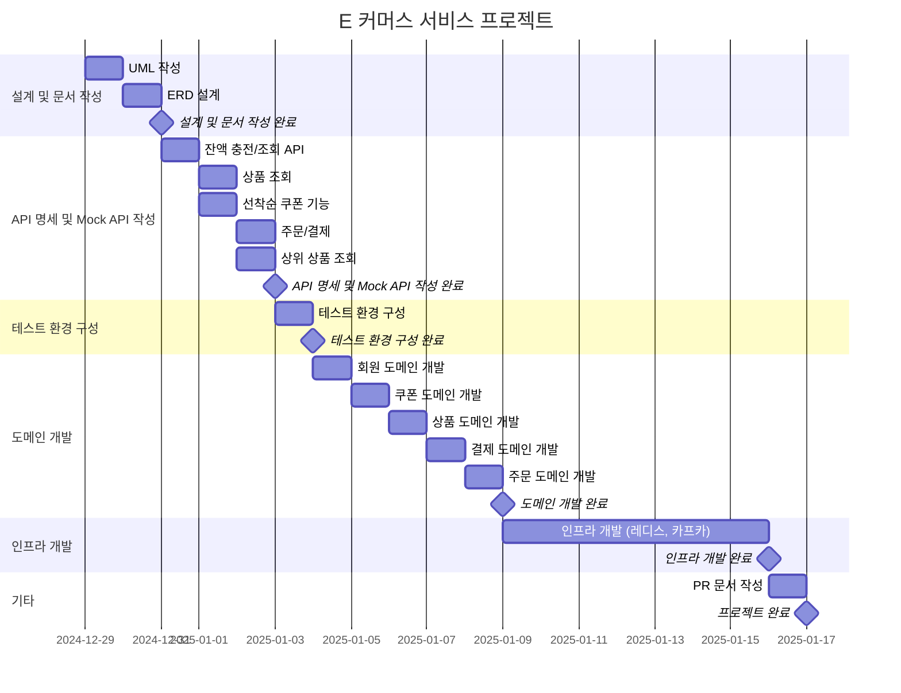
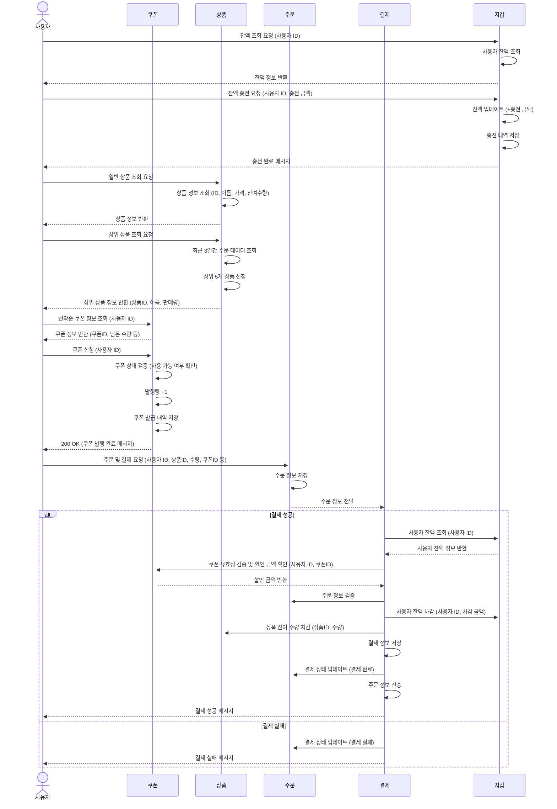
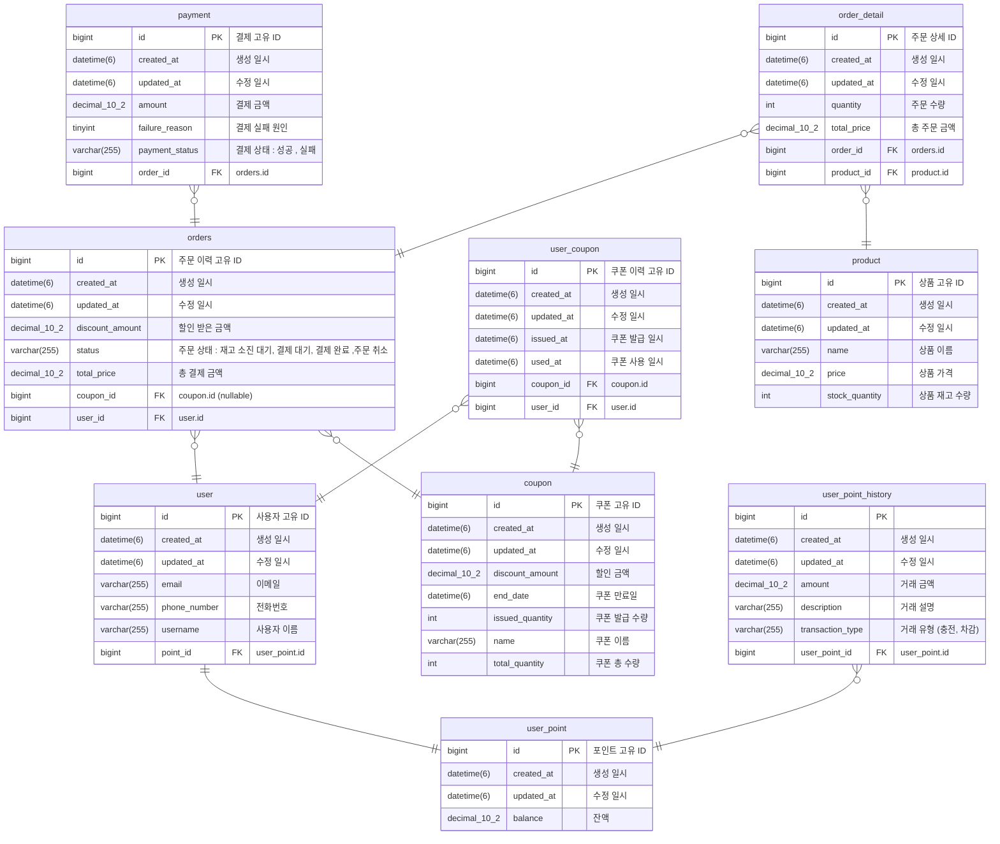

## E-Commerce

현업에서 요구되는 복잡도를 고려하여, e커머스의 핵심 기능(잔액 충전/조회, 상품 조회, 선착순 쿠폰 발급, 주문/결제, 데이터 플랫폼 전송)을 클린 아키텍처 원칙에 따라 구현하고, 동시성 이슈와 단위·통합 테스트를 통해 실무에 준하는 품질과 유지보수성을 확보하는 것을 목표로 합니다.

### 프로젝트 기간
- 2024-12-29 ~ 2025-01-16 (총 16 MD)

### 총 소요 기간
  총 16 MD (Man-days)

### 주요 마일스톤
1. **설계 및 문서 작성 (2024-12-31)**
   - UML 작성, ERD 설계
2. **API 명세 및 Mock API 작성 (2025-01-03)**
   - 잔액 충전/조회 API, 상품 조회, 선착순 쿠폰 기능, 주문/결제, 상위 상품 조회
3. **테스트 환경 구성 (2025-01-04)**
   - 테스트 환경(테스트컨테이너 등) 구축 및 설정
4. **도메인 개발 (2025-01-09)**
   - 회원, 쿠폰, 상품, 결제, 주문 도메인
5. **인프라 개발 (2025-01-16)**
   - Redis, Kafka 설정 및 개발
6. **프로젝트 배포 (2025-01-17)**
   - PR 문서 작성, 최종 점검

# 요구사항 기반 전체 시퀀스 다이어그램

아래 시퀀스 다이어그램은 **E 커머스 서비스의 주요 요구사항**에 따른 **도메인 간 상호작용**을 시각화한 것입니다.

**회원(사용자), 지갑, 쿠폰, 상품, 결제, 주문** 등 주요 도메인이 REST API 기반으로 어떻게 연동되는지 한눈에 파악할 수 있습니다.

### 주요 기능

- **사용자 잔액 충전 및 조회**
- **상품 정보 조회**
- **선착순 쿠폰 발급 및 조회**
- **주문 및 결제 처리**
- **데이터 플랫폼으로의 주문 정보 전송**

# ERD

## 테이블/관계 설명

1. **`user` / `user_point`**
   - 사용자(`user`) 테이블은 포인트(`user_point`) 테이블을 참조(`point_id`)하여 1:1 관계를 형성합니다.
   - 한 명의 사용자는 하나의 포인트 계정(잔액 관리)을 갖습니다.
2. **`user_point_history`**
   - `user_point_history`는 **거래 내역**을 저장하는 테이블입니다.
   - `user_point_id`로 `user_point`를 참조하며, 사용자 포인트에 대한 충전·차감 기록을 저장합니다(다대일).
3. **`user_coupon`**
   - 쿠폰 발급 이력과 사용 이력을 관리하는 테이블입니다.
   - `coupon_id`로 `coupon`을, `user_id`로 `user`를 참조하며, 여러 사용자가 여러 쿠폰을 각각 발급·사용할 수 있습니다.
4. **`orders`**
   - 주문 이력을 저장하는 테이블로, 한 사용자(`user_id`)가 여러 주문을 가질 수 있습니다(다대일).
   - 옵션으로 `coupon_id`를 참조하며, 쿠폰을 사용하지 않은 경우 `NULL`이 가능합니다.
5. **`payment`**
   - 결제 정보를 저장하는 테이블로, 결제 상태(`payment_status`)와 실패 원인(`failure_reason`)을 함께 관리합니다.
   - 각 결제(`payment`)는 주문(`orders.id`)을 참조해 결제 대상을 명시합니다.
6. **`order_detail`**
   - 주문 상세 정보 테이블로, 주문(`order_id`)과 상품(`product_id`)을 참조합니다.
   - 한 주문에 여러 상품을 담을 수 있으므로, 주문-주문상세는 1:N 관계입니다.
7. **`coupon`**
   - 쿠폰의 메타정보(쿠폰 이름, 총 수량, 발급 수량, 할인 금액 등)을 저장합니다.
   - 유효기간(`end_date`)이 지나면 사용 불가능한 것으로 간주됩니다.
8. **`product`**
   - 상품 정보를 담고 있으며, `stock_quantity` 필드를 통해 재고 수량을 관리합니다.

API Swagger

프로젝트 3주차 회고록

### E-Commerce 플랫폼 서버 개발 3주차 회고록

---

E-Commerce 플랫폼 서버를 **제로부터 완성**하는 프로젝트가 어느덧 3주차에 접어들었습니다. 매주 새로운 요구사항이 주어지는 환경에서, 단순히 기능 구현에 그치지 않고 **실무와 최대한 유사한 경험**을 만들어내기 위해 노력하고 있습니다. 이러한 과정에서 많은 고민과 시도를 통해 **개발자로서의 성장**을 체감할 수 있었습니다.

---

### **테스트 코드의 중요성**

기능을 완성해가며 추가되는 요구사항에 따라 코드를 수정하고 **리팩터링**하는 상황이 자주 발생하자, 테스트 코드의 필요성과 중요성을 다시한번 깨닫게 되었습니다.

테스트 코드는 단순히 기능 확인을 넘어, 코드 수정과 재구성을 **안정적이고 빠르게** 진행할 수 있도록 도와주었습니다. 특히, 리팩터링이나 기능 추가 시 **테스트 코드 덕분에 자신감을 가지고 작업**할 수 있었습니다. 이는 실무에서도 필수적인 개발 습관이자 역량임을 다시 한번 느끼는 계기가 되었습니다.

---

### **몰입의 과정과 성장을 경험하다**

이번 프로젝트는 **직장 생활과 병행**하면서 진행되고 있습니다. 매일 아침 눈을 뜨자마자 출근 후 개발을 하고, 퇴근 후 밤늦게까지 코드를 고민하는 과정은 체력적으로 쉽지 않았지만, **몰입을 통해 얻은 성취감**이 이를 상쇄시켰습니다.

가장 뿌듯했던 순간은, 불과 이주일 전 작성한 코드가 레거시처럼 느껴질 만큼 **눈에 띄는 성장**을 경험했을 때입니다. 더 나은 설계와 코드를 고민하며 꾸준히 발전하고 있다는 실감이 저를 더욱 **열정적으로** 만들었습니다.

---

### **앞으로의 다짐**

프로젝트가 완성될 때까지 **최대한 많은 것을 배우고 성장**할 수 있도록 집중할 것입니다. 남은 기간 동안에도 테스트 코드 작성, 효율적인 설계, 그리고 새로운 기술 도입에 대한 고민을 이어가며 **더 나은 개발자**로 거듭나고자 합니다.

