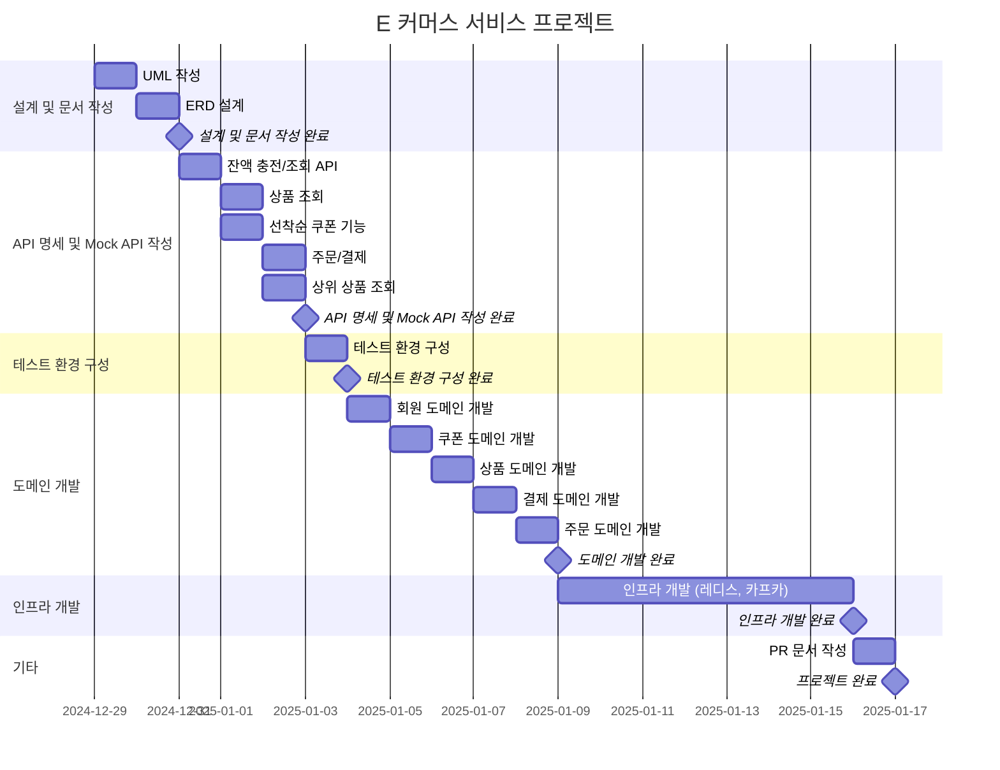
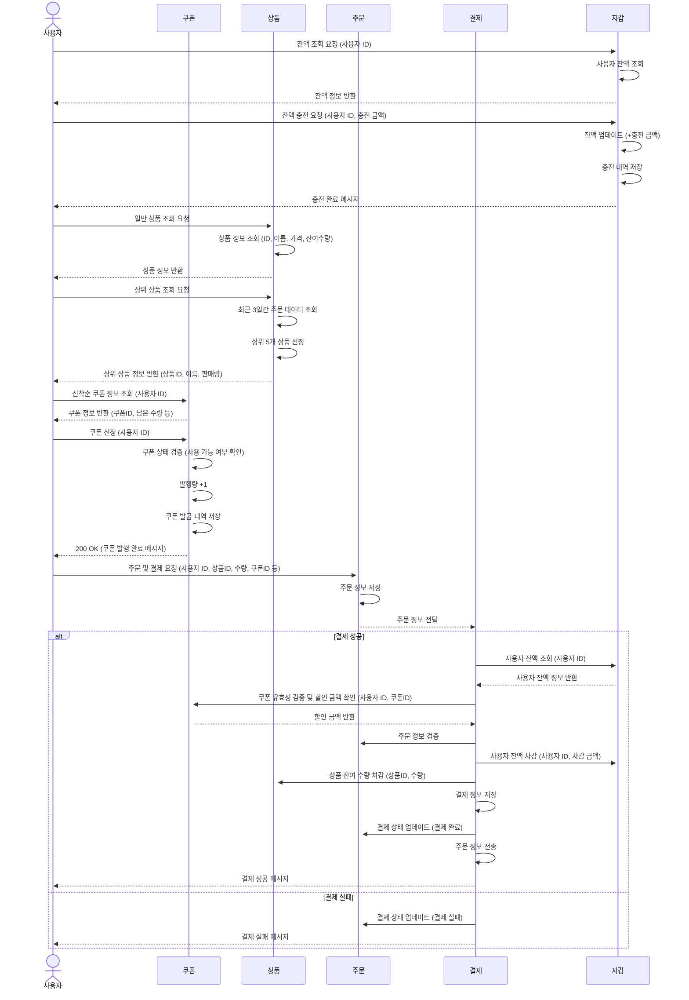

## E 커머스 MILESTONE

### 프로젝트 기간
- 2024-12-29 ~ 2025-01-16

### 총 소요 기간
  총 16 MD (Man-days)

### 주요 마일스톤
1. **설계 및 문서 작성**
    - 날짜: **2024-12-31**
    - 주요 작업: UML 작성, ERD 설계

2. **API 명세 및 Mock API 작성**
    - 날짜: **2025-01-03**
    - 주요 작업: 잔액 충전/조회 API, 상품 조회, 선착순 쿠폰 기능, 주문/결제, 상위 상품 조회

3. **테스트 환경 구성**
    - 날짜: **2025-01-04**
    - 주요 작업: 테스트 환경 구축 및 설정

4. **도메인 개발**
    - 날짜: **2025-01-09**
    - 주요 작업: 회원, 쿠폰, 상품, 결제, 주문 도메인 개발

5. **인프라 개발**
    - 날짜: **2025-01-16**
    - 주요 작업: Redis, Kafka 설정 및 개발

6. **프로젝트 배포**
    - 날짜: **2025-01-17**
    - 주요 작업: PR 문서 작성 및 최종 점검

# 요구사항 기반 전체 시퀀스 다이어그램
- E 커머스 서비스의 주요 요구사항을 기반으로, 주요 도메인 간의 상호작용을 표현한 것입니다. 
- 서비스의 전반적인 흐름과 각 기능 간의 관계를 시각적으로 이해할 수 있도록 작성되었습니다.
- 다이어그램에 포함된 각 요청 및 응답은 REST API 를 기반으로 합니다.

### 주요 기능 포함 내용
- 사용자 잔액 충전 및 조회
- 상품 정보 조회
- 선착순 쿠폰 발급 및 조회
- 주문 및 결제 처리
- 데이터 플랫폼으로의 주문 정보 전송

